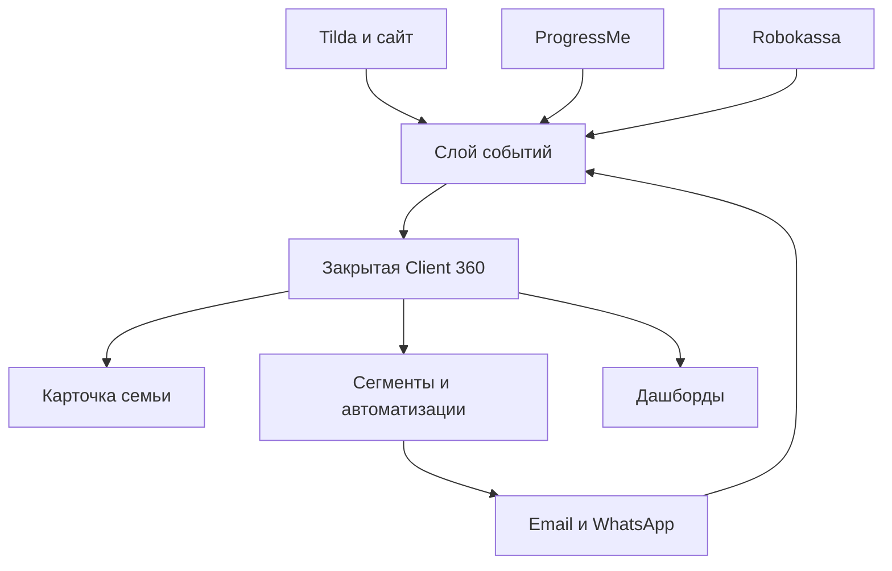

# 01. Карта системы

## Источники данных

| Источник | Что забираем | Что не считаем источником истины |
|---|---|---|
| Формы Tilda / langust.online | заявка, источник, UTM, класс, учебник, комментарий, согласия | факт обучения и оплаты |
| Личный кабинет | регистрация, входы, сессии, просмотр страниц, действия | банковский статус платежа |
| ProgressMe | доступ, курс, уроки, задания, активность, окончание доступа | согласие на маркетинг |
| Robokassa | платеж, сумма, валюта, статус, возврат, внешний ID | состав семьи и школьная тема |
| Email-провайдер | доставка, открытие при допустимом трекинге, клик, отписка, жалоба | реальный учебный прогресс |
| WhatsApp / телефон | сообщение, звонок, результат контакта, обещание | автоматическое маркетинговое согласие |
| Gmail | история личной переписки и поддержки | единая CRM без нормализации |
| Ручной ввод | заметки, задача, причина отказа, итог звонка | автоматически подтверждённый факт без автора и времени |

## Контуры

## Источник истины по доменам

| Домен | Источник истины |
|---|---|
| Семья и связи родитель–ребёнок | Client 360 |
| Согласия | Consent ledger в Client 360 |
| Статус заявки и следующий шаг | Client 360 |
| Учебный прогресс | ProgressMe / платформа |
| Оплата и возврат | Robokassa + бухгалтерский учёт |
| Контент страницы / оффер | Base и сайт |
| Отправка и доставка письма | email-провайдер |
| Переписка | канал контакта + нормализованный журнал CRM |

## Идентификаторы

Нельзя связывать системы по одному email: адрес меняется, бывает общий семейный адрес, один родитель может подать несколько заявок.

Нужны внутренние UUID:

- `family_id` — семья;
- `guardian_id` — взрослый контакт;
- `student_id` — ребёнок;
- `lead_id` — конкретная заявка;
- `enrollment_id` — запись ребёнка на конкретный курс;
- `interaction_id` — контакт;
- `payment_id` — внутренний платёж;
- `event_id` — уникальное событие.

Внешние ID хранятся отдельно с указанием системы: `progressme_user_id`, `robokassa_invoice_id`, `tilda_submission_id`.

## Дедупликация

Предлагаемый порядок:

1. Точное совпадение внешнего ID.
2. Нормализованный телефон родителя.
3. Нормализованный email + совпадающее имя ребёнка.
4. Только email — кандидат на объединение, не автоматическое объединение.
5. Только фамилия или имя — никогда не объединять автоматически.

Любое ручное объединение хранит автора, время и список объединённых записей; действие должно быть обратимым.

## Запреты архитектуры

- Не хранить реальные данные в GitHub.
- Не делать Gmail единственной CRM.
- Не перезаписывать историю: статус меняется, события остаются.
- Не удалять источник согласия при обновлении контакта.
- Не смешивать родителя и ребёнка в одной записи `client`.
- Не связывать siblings как разные семьи только потому, что заявок несколько.
- Не считать открытие письма доказательством интереса: оно ненадёжно и может генерироваться защитой почты.

