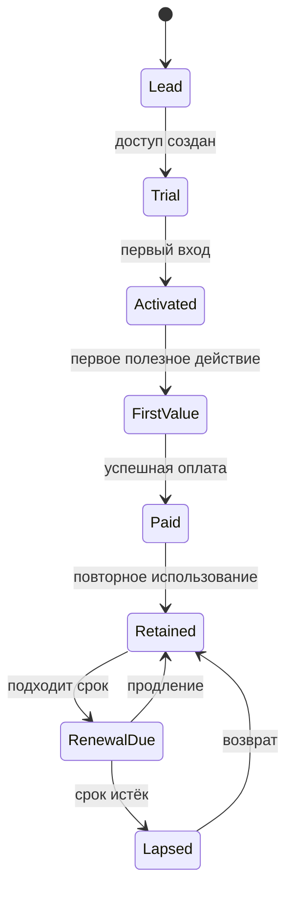

# 45. Состояния пути семьи

Состояние семьи вычисляется из событий. Его нельзя произвольно менять ради красивого отчёта. Ручная корректировка требует причины и аудита.

## Дополнительные состояния

- `unqualified` — заявка не относится к продукту;
- `blocked` — безопасность, fraud или обязательное ручное решение;
- `support_hold` — открытая критичная проблема, продажи приостановлены;
- `payment_pending` — платёж начат, итог ещё не подтверждён;
- `refund_pending` и `refunded`;
- `marketing_suppressed` — не заменяет продуктовый state, а накладывается отдельно;
- `deleted_or_restricted` — профиль исключён из обычной работы.

## Переходы

| Переход | Обязательное доказательство |
|---|---|
| lead → trial | trial_created + срок доступа |
| trial → activated | подтверждённый first_login |
| activated → first_value | событие из утверждённого списка value events |
| first_value → paid | payment_succeeded и reconciliation |
| paid → retained | активность в заданном окне |
| renewal_due → lapsed | срок доступа истёк, оплаты нет |
| lapsed → retained | новая оплата и восстановленный доступ |

## Правила коммуникации

- открытый support hold подавляет продажи;
- refund pending подавляет upsell;
- marketing suppressed разрешает только необходимые сервисные сообщения;
- каждое состояние имеет допустимые кампании, лимит частоты и exit criteria;
- если события противоречат друг другу, создаётся задача на reconciliation, а не выбирается удобный статус.
