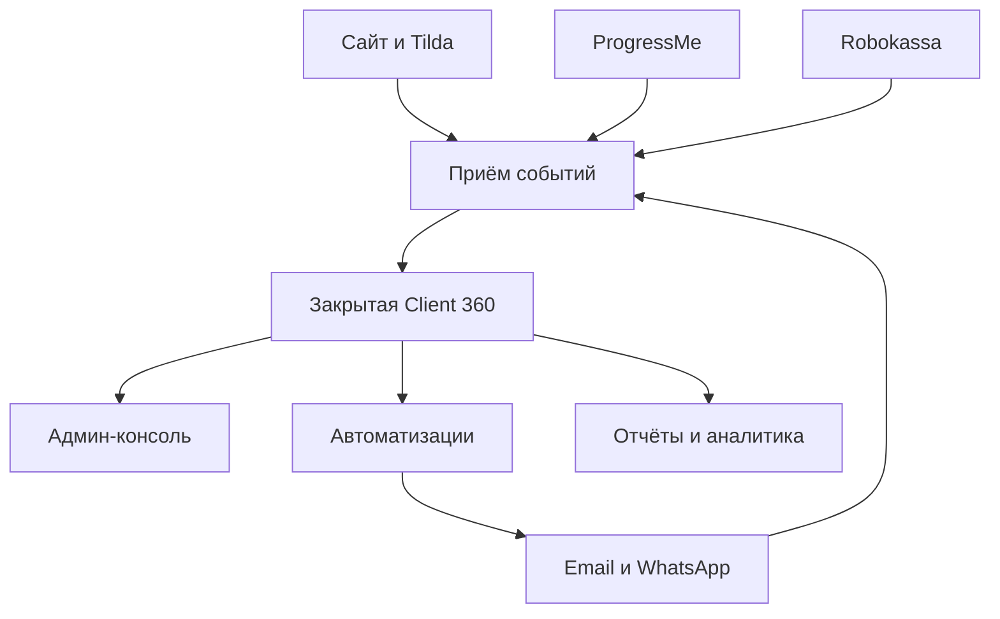

# 48. Мастер-ТЗ: LANGUST Client 360

Статус: проект требований для сверки  
Версия: 1.0  
Дата: 21 сентября 2026  
Владелец продукта: Татьяна Владимировна  
Основной оператор: Гузель  

## 0. Назначение документа

Это единое техническое задание на закрытую клиентскую систему LANGUST. Оно объединяет требования к CRM, воронкам, email-маркетингу, оплатам, учебной активности, поддержке, аналитике, приватности и ежедневной работе команды.

Документ нужен для:

- сравнения с параллельно разрабатываемой системой;
- оценки архитектуры и трудозатрат;
- декомпозиции задач разработчику;
- приёмки по наблюдаемым критериям;
- предотвращения опасных массовых отправок и утечек;
- фиксации решений, которые пока не приняты.

Если это ТЗ расходится с законом, договором платёжного провайдера или правилами канала, обязательное требование имеет приоритет. Юридические формулировки и сроки хранения должны пройти отдельную проверку для фактических стран работы.

## 1. Контекст и бизнес-цели

LANGUST — онлайн-обучение английскому для младших школьников. Основной сценарий на момент подготовки ТЗ: ребёнок занимается по школьному Spotlight, родитель покупает и контролирует доступ, пользователь продукта — ребёнок.

Ценность продукта:

- ребёнок постепенно делает школьный английский самостоятельнее;
- родитель меньше выполняет роль домашнего репетитора;
- обучение связано с текущей школьной темой, а не существует отдельно;
- родитель получает наблюдаемый результат и понятный прогресс.

Бизнес-цели системы:

1. Не терять заявки и обещания клиентам.
2. Доводить пробный доступ до первого учебного результата.
3. Увеличить долю активированных пробников и оплат без давления.
4. Видеть семью целиком, а не набор несвязанных email и платежей.
5. Снизить ручную работу Татьяны и Гузель.
6. Своевременно обнаруживать оплату без доступа, технические проблемы и риск ухода.
7. Считать доход, возвраты, расходы и вклад в цель 130 000 ₽ чистыми в месяц.
8. Отправлять только разрешённые, релевантные и проверяемые сообщения.
9. Давать родителю полезные отчёты об обучении ребёнка.
10. Создать основу для новых классов, учебников, регионов и продуктов.

## 2. Границы проекта

### 2.1. Входит в проект

- закрытая Client 360;
- семьи, родители, дети и связи между ними;
- заявки, пробники, курсы и доступы;
- журнал контактов по всем каналам;
- задачи, обещания, обращения и причины отказов;
- согласия, предпочтения и запреты;
- email-кампании и безопасная автоматизация;
- WhatsApp как журнал и разрешённый канал, если доступна легальная интеграция;
- события сайта, кабинета и обучения;
- платежи, возвраты и сверка доступа;
- расходы, выручка и базовая экономика;
- отчёты родителям;
- сегменты, очереди, дашборды и ежедневные сводки;
- импорт имеющихся семей через staging;
- аудит, резервное копирование и обработка инцидентов;
- API и webhook-контракты интеграций.

### 2.2. Не входит в первую версию

- хранение банковских карт;
- запись телефонных разговоров по умолчанию;
- тотальная запись экрана или движений мыши;
- автоматические ответы родителям от ИИ без контроля;
- сложная предиктивная модель ухода на малом объёме данных;
- мобильное приложение;
- полноценная бухгалтерская система;
- замена ProgressMe, Robokassa, Gmail или сайта;
- медицинские, школьные и иные детские данные без документированной цели;
- массовая рассылка до готовности согласий, suppression, dry run и отписки.

### 2.3. Главный запрет

Публичный репозиторий `langustlingua/Base` хранит только код, схемы, документацию и синтетические примеры. Реальные ФИО, email, телефоны, даты рождения, переписка, платежи, IP, идентификаторы внешних систем, выгрузки и резервные копии в GitHub запрещены.

## 3. Термины

| Термин | Значение |
|---|---|
| Семья | контейнер отношений одного или нескольких взрослых и детей |
| Родитель | взрослый контакт или законный представитель |
| Ребёнок | ученик, к которому относится обучение |
| Заявка | отдельный факт отправки формы или ручного обращения |
| Пробник | ограниченный по времени доступ к курсу |
| Enrollment | доступ ребёнка к конкретному курсу и версии продукта |
| Первый результат | первое подтверждённое полезное действие в продукте |
| Взаимодействие | письмо, сообщение, звонок, встреча или внутренний контакт |
| Кампания | версия сегмента, оффера, шаблонов, расписания и правил остановки |
| Сервисное сообщение | необходимое для заявки, доступа, оплаты, поддержки или договора |
| Маркетинговое сообщение | предложение, акция, прогрев, реактивация или рекомендация |
| Suppression | запрет отправки по адресу, номеру, семье или назначению |
| Dry run | расчёт отправки без фактической передачи сообщения провайдеру |
| Источник истины | система, чей факт считается каноническим в домене |

## 4. Пользователи и роли

### 4.1. Владелец — Татьяна

Может:

- видеть все рабочие данные;
- утверждать цены, офферы, кампании и массовые отправки;
- просматривать финансы и прибыль;
- менять роли;
- просматривать аудит;
- запускать экспорт, объединение, ограничение и удаление данных;
- включать и останавливать интеграции.

### 4.2. Оператор — Гузель

Может:

- работать с очередью «Сегодня»;
- создавать и редактировать контакты, задачи, обещания и обращения;
- помогать со входом и выбором урока;
- менять операционные статусы по подтверждённым фактам;
- готовить сообщения и выполнять разрешённые единичные отправки.

Не может:

- запускать массовую кампанию;
- менять цену и активный оффер;
- экспортировать всю базу;
- удалять или объединять семьи без подтверждения;
- видеть секреты и полные технические токены;
- изменять аудит и историю согласий.

### 4.3. Технический администратор

Может обслуживать инфраструктуру и интеграции. Доступ к PII — только в необходимом объёме, с аудитом. Не должен автоматически получать право запускать маркетинг или видеть финансы.

### 4.4. Аналитик / read-only

Получает агрегированные или псевдонимизированные данные. По умолчанию не видит контакты, свободные заметки, переписку и детские данные.

### 4.5. Родитель

Видит только свою семью: доступы, прогресс, сообщения, предпочтения и разрешённые функции самообслуживания. Публичные ссылки на прогресс должны быть одноразовыми или отзываемыми, с ограниченным сроком и защитой от перебора.

## 5. Архитектурная модель

### 5.1. Логические компоненты

1. Web-интерфейс администратора.
2. Backend API.
3. Реляционная база данных PostgreSQL.
4. Слой приёма и дедупликации событий.
5. Планировщик задач и автоматизаций.
6. Очередь фоновой обработки и повторов.
7. Адаптеры Tilda, сайта, ProgressMe, Robokassa, email и WhatsApp.
8. Хранилище временных экспортов и вложений с ограниченным доступом.
9. Система аудита и наблюдаемости.
10. Аналитический слой и ежедневные snapshots.

### 5.2. Контуры

### 5.3. Источники истины

| Домен | Источник истины |
|---|---|
| семья и связи | Client 360 |
| согласия и запреты | журнал согласий Client 360 |
| заявка и следующий шаг | Client 360 |
| учебная активность | ProgressMe или собственная учебная платформа |
| платёж и возврат | Robokassa + учёт |
| оффер и текст | реестр офферов/шаблонов + Base |
| доставка сообщения | провайдер канала |
| полная исходная переписка | исходный канал |
| нормализованный результат контакта | Client 360 |

### 5.4. Среды

Обязательны `local/development`, `staging` и `production`.

- staging не использует реальных получателей и production-ключи;
- тестовые письма уходят только на allowlist;
- production доступен только по HTTPS;
- секреты не копируются между средами вручную;
- база staging очищается или обезличивается по расписанию;
- доменная схема кабинета согласуется отдельно с доменом ProgressMe White Label.

## 6. Идентификаторы и модель семьи

### FR-ID-01

Система должна использовать внутренние UUID: `family_id`, `guardian_id`, `student_id`, `lead_id`, `enrollment_id`, `interaction_id`, `payment_id`, `event_id`, `task_id`, `case_id`.

### FR-ID-02

Внешние ID хранятся отдельно с указанием системы. Email и телефон не являются первичным ключом.

### FR-ID-03

Одна семья может иметь нескольких родителей и детей. Один родитель может иметь несколько email/телефонов в будущей версии; в MVP допускается основной email и основной телефон при наличии истории изменений.

### FR-ID-04

Повторная заявка не создаёт автоматически новую семью. Сначала выполняется сопоставление и создаётся отдельный `lead`.

### FR-ID-05

Объединение записей должно быть обратимым, записывать автора, время, причину, прежние ID и выбранные значения.

### FR-ID-06

Автоматическое объединение допустимо только по устойчивому внешнему ID или однозначному подтверждённому правилу. Совпадение одного email создаёт кандидата на проверку.

## 7. Обязательные сущности

### 7.1. Семья `families`

Обязательные и ключевые поля:

`family_id`, `display_name`, `lifecycle_stage`, `city`, `region`, `country`, `timezone`, `preferred_language`, `acquisition_source`, `first_touch_at`, `owner_user_id`, `next_best_action`, `next_action_at`, `risk_level`, `tags`, `created_at`, `updated_at`.

Статусы: `lead`, `trial`, `customer`, `paused`, `churned`, `archived`, `restricted`.

### 7.2. Родитель `guardians`

`guardian_id`, `family_id`, имя, фамилия, отношение к ребёнку, нормализованный email, телефон E.164, предпочтительный канал, окно контакта, статусы согласий, deliverability, do-not-call, birthday month/day, restricted notes, timestamps.

### 7.3. Ребёнок `students`

`student_id`, `family_id`, имя, год рождения при необходимости, birthday month/day при отдельном разрешении, класс, учебник, текущий модуль, учебная цель, тип трудности, accessibility notes, внешний ID, последняя учебная активность.

По умолчанию не собирать точную дату рождения с годом, школу, букву класса, адрес, геолокацию, диагнозы и документы.

### 7.4. Заявка `leads`

`lead_id`, связи с семьёй/родителем/ребёнком, `submitted_at`, `form_id`, landing URL, UTM, referrer, promo code, campaign key, исходный комментарий, статус, квалификация, исполнитель, timestamps.

Статусы: `new`, `contacted`, `trial_created`, `activated`, `qualified`, `checkout`, `won`, `lost`, `invalid`, `duplicate`.

### 7.5. Согласие `consents`

Каждое изменение — новая неизменяемая запись: субъект, назначение, статус, время, источник, версия текста, доказательство, минимизированный технический след, время отзыва.

Назначения минимум: обработка заявки, email-маркетинг, маркетинг в мессенджере, необязательная аналитика, отзыв/UGC, поздравление, отчёты родителю.

### 7.6. Курс и доступ `courses`, `enrollments`

Курс содержит класс, учебник, версию и статус. Enrollment связывает ребёнка с курсом и хранит trial/access dates, тариф, источник заявки, внешний ID, статус, паузу и причину окончания.

### 7.7. Контакт `interactions`

Хранит семью, родителя, ребёнка при необходимости, канал, направление, тип, тему, краткое резюме, исход, даты доставки/ответа, шаблон, кампанию, сотрудника, внешний ID и следующий шаг.

### 7.8. Платёж `payments`

Хранит провайдера, invoice ID, сумму в минимальных единицах, валюту, статус, оплату, возврат, промокод, кампанию, чек, безопасный код ошибки, период и связь с доступом.

Полный номер карты, CVV и банковские секреты не сохраняются.

### 7.9. Задача, обещание, поддержка

- `tasks`: исполнитель, приоритет, тип, срок, статус, источник и результат;
- `promises`: что обещано, кому, кем, срок, статус и подтверждение выполнения;
- `support_cases`: категория, severity, SLA, владелец, причина, решение и CSAT.

### 7.10. Остальные обязательные реестры

- события;
- suppression;
- аудит;
- офферы;
- шаблоны;
- кампании и одобрения;
- доставки сообщений;
- web-сессии;
- рекомендации и права на контент;
- расходы;
- OAuth-подключения;
- запросы на данные;
- сбои интеграций;
- эксперименты;
- ежедневные snapshots.

Каноническая физическая модель: [`schema.sql`](schema.sql). Детальные определения полей: [`02-data-dictionary.md`](02-data-dictionary.md).

## 8. Функциональные требования: интерфейс

### FR-UI-01. Вход

- персональный аккаунт каждого сотрудника;
- 2FA для владельца и администраторов;
- отсутствие общих паролей;
- сессии с истечением и принудительным отзывом;
- отображение последнего входа и активных сессий.

### FR-UI-02. Экран «Сегодня»

Показывает приоритетную очередь:

1. privacy-запросы и жалобы;
2. возвраты и оплаты без доступа;
3. просроченные обещания;
4. нерешённую поддержку;
5. новые заявки без ответа;
6. пробники без входа более двух часов;
7. пробники, заканчивающиеся сегодня;
8. низкую учебную активность;
9. разрешённые поводы и поздравления;
10. задачи оператора.

Каждая строка должна показывать причину попадания, срок, ответственного, последнее действие и один основной CTA.

### FR-UI-03. Карточка семьи

Шапка:

- название семьи;
- основной родитель и контакты;
- дети;
- lifecycle state;
- owner;
- согласия и запреты;
- риск;
- next best action;
- ближайшая задача.

Вкладки:

- обзор;
- семья и дети;
- заявки и пробники;
- обучение;
- контакты;
- задачи и обещания;
- поддержка;
- оплаты и доступы;
- согласия;
- важные даты;
- аудит.

### FR-UI-04. Список семей

Поиск по имени, email, телефону, ID, invoice и внешнему ID. Фильтры по стадии, классу, учебнику, активности, региону, согласию, риску, оплате и ответственному. Сохранённые представления доступны по роли.

### FR-UI-05. Сегменты

Конструктор должен:

- показывать понятные условия без SQL;
- рассчитывать размер сегмента;
- показывать случайную выборку;
- объяснять включение конкретной семьи;
- исключать suppression и недопустимые согласия;
- сохранять версию определения;
- запрещать массовый экспорт оператору.

### FR-UI-06. Кампания

Редактор показывает цель, сегмент, исключения, канал, шаблон, оффер, расписание, частотный лимит, stop events, владельца и срок одобрения. По умолчанию — dry run.

### FR-UI-07. Мобильный режим

С телефона должны быть доступны очередь, карточка семьи, контакт, задача, обещание и support case. Массовые операции и изменение прав с телефона запрещены или требуют повторной проверки.

## 9. Заявки и трёхдневный пробник

### FR-TRIAL-01

Факт заявки и факт созданного доступа — разные события. Отсчёт пробника начинается только по подтверждённому правилу продукта.

### FR-TRIAL-02

Минимальные состояния: создан, доставлен без входа, вошёл без старта, начал без результата, первый результат, engaged, checkout, купил, истёк неактивным, истёк активным, support hold, suppressed.

### FR-TRIAL-03

Воронка должна реагировать на поведение, а не отправлять одинаковую цепочку всем.

### FR-TRIAL-04

Покупка, отказ, complaint и suppression немедленно отменяют продажи. Открытая поддержка ставит продажи на паузу.

### FR-TRIAL-05

Смоленская ветка разрешена только для подтверждённого сегмента второго класса и активного оффера. Зафиксированные условия кампании 2026: 7 900 ₽ за учебный год, «60% скидка», промокод «Смоленск», окончание 5 октября без продления дедлайна.

### FR-TRIAL-06

Стандартная цена не зашивается в код: она читается из активного реестра офферов.

### FR-TRIAL-07

Полные тексты, тайминг и ветки определены в [`../post-lead-funnel-3-day-trial.md`](../post-lead-funnel-3-day-trial.md), исполняемые правила — в [`trial-funnel.json`](trial-funnel.json).

## 10. Контакты, дневники и история

### FR-COM-01

В одной временной шкале отображаются email, WhatsApp, звонки, обращения, обещания, задачи, оплаты и ключевые учебные события с фильтрами.

### FR-COM-02

Для каждого контакта обязателен исход из справочника, а при необходимости — следующий шаг и срок.

### FR-COM-03

Свободная заметка содержит факты, а не оценки личности. Доступ к чувствительным заметкам ограничен.

### FR-COM-04

Оригинал Gmail остаётся в Gmail. CRM хранит ссылку/ID, краткое резюме, исход и необходимые метаданные; полное копирование всей почты не требуется.

### FR-COM-05

Должны существовать отдельные журналы: контакты, семья, обучение, обещания, поддержка, возражения, задачи, исследования и разрешения на контент.

## 11. Email-маркетинг и кампании

### FR-EM-01. Разделение потоков

Сервисные и маркетинговые сообщения имеют разные purpose, основания, шаблоны и правила остановки. Реклама не маскируется под сервис.

### FR-EM-02. Программы

Минимальный реестр: welcome, пробник, no-login, checkout recovery, onboarding, первая неделя, низкая активность 7/14/30, milestone, отчёт родителю, продление, payment failure, churn risk, win-back, учебный год, referral, birthday.

### FR-EM-03. Шаблон

Версия шаблона содержит канал, язык, subject, preheader, body, CTA, разрешённые переменные, purpose, tone status, юридические элементы, автора, статус и историю публикации.

### FR-EM-04. Оффер

Оффер содержит аудиторию, продукт, цену, валюту, период, скидку, промокод, start/end, landing URL, ограничения, статус и автора одобрения.

### FR-EM-05. Кампания

Статусы: `draft`, `dry_run`, `pending_approval`, `approved`, `scheduled`, `running`, `paused`, `completed`, `cancelled`, `expired`.

### FR-EM-06. Одобрение

Запуск требует одобрения владельца конкретных immutable-версий сегмента, шаблона, оффера и расписания. Одобрение имеет срок действия и аннулируется при изменении любого компонента.

### FR-EM-07. Dry run

Dry run показывает размер, причины включения, исключения, примеры подстановки, распределение по каналам, цену, ссылки, частотные конфликты и стоп-события. Фактической отправки нет.

### FR-EM-08. Частота

- максимум две автоматические коммуникации за 24 часа суммарно;
- максимум три маркетинговых контакта в неделю вне отдельной активной кампании;
- человеческий ответ ставит автоматику на паузу;
- WhatsApp не повторяет email без отдельной причины;
- quiet hours учитывают часовой пояс семьи.

### FR-EM-09. Доставляемость

Требуются SPF, DKIM, DMARC, контролируемые From/Reply-To, bounce/complaint webhook, List-Unsubscribe, one-click unsubscribe, suppression и мониторинг репутации.

### FR-EM-10. Остановка

У кампании есть kill switch. При аномальном hard bounce, complaints, отписках или ошибочной цене отправка автоматически ставится на паузу.

### FR-EM-11. Метрики

Open rate вспомогателен. Главные метрики: доставка, жалобы, отписки, клики, ответы, активация, первое полезное действие, checkout, покупка и удержание.

## 12. Согласия и центр предпочтений

### FR-CON-01

Импорт контакта не означает маркетинговое согласие.

### FR-CON-02

Родитель отдельно управляет email-маркетингом, WhatsApp-маркетингом, советами, акциями, отчётами, поздравлениями и частотой.

### FR-CON-03

Отписка должна быть доступна без входа, исполняться немедленно и подтверждаться нейтрально, без повторной продажи.

### FR-CON-04

Ручная просьба «не писать» создаёт suppression с приоритетом выше кампаний и scores.

### FR-CON-05

Consent ledger неизменяем; исправление создаёт новую запись. Система хранит версию текста и доказательство.

### FR-CON-06

Сервисное сообщение разрешается только для реальной сервисной цели и не должно содержать несвязанный оффер.

## 13. Дни рождения и важные даты

### FR-DATE-01

Точная дата рождения не запрашивается «на всякий случай». Для поздравления по умолчанию достаточно месяца и дня, без года.

### FR-DATE-02

Поздравление ребёнка отправляется родителю и требует отдельного разрешения. В теме не показывается возраст ребёнка.

### FR-DATE-03

Система также поддерживает даты первой заявки, первой оплаты, первого результата, годовщины клиента, начала/окончания доступа, учебных периодов, обещаний, renewals и кампаний.

### FR-DATE-04

Поздравление не должно быть замаскированной срочной продажей.

## 14. Учебная активность и посещаемость

### FR-LRN-01

Система получает курс, модуль, урок, начало/завершение, упражнения, активное время, повторную сессию, milestone и последнее занятие.

### FR-LRN-02

Учебной сессией считается взаимодействие с материалом, а не фоновое открытие вкладки.

### FR-LRN-03

Показатели ребёнка: первая ценность, завершённые действия, активные дни, повторяемость, текущая тема, трудности, длительность сессий и последняя активность.

### FR-LRN-04

Нельзя показывать родителю ложную точность, рейтинг ребёнка или оценочный ярлык без методического основания.

### FR-LRN-05

Статусы недели: активен, низкая активность, отсутствует, пауза, каникулы, техническая блокировка, доступ закончился.

### FR-LRN-06

Сигнал отсутствия создаёт помощь или задачу, а не автоматическое обвиняющее сообщение.

## 15. Отчёты родителям

### FR-REP-01

Недельный отчёт содержит период, занятия, активные дни, завершённые действия, текущую тему, одну наблюдаемую победу и один следующий шаг.

### FR-REP-02

Месячный отчёт показывает динамику, а не только сумму кликов.

### FR-REP-03

Отчёт не содержит сравнений с другими детьми, диагнозов, манипуляций и недоказанных выводов.

### FR-REP-04

Родитель управляет частотой. При отсутствии данных система честно сообщает, что активности недостаточно для вывода.

### FR-REP-05

Ссылка на отчёт ограничена по сроку, отзываема, read-only и не раскрывает PII в URL.

## 16. Платежи, возвраты и доступ

### FR-PAY-01

Webhook провайдера проверяется криптографически, дедуплицируется и сохраняется с безопасным raw reference.

### FR-PAY-02

Статусы: created, pending, succeeded, failed, cancelled, partially_refunded, refunded, disputed.

### FR-PAY-03

Оплата не считается завершённой по возврату браузера; только подтверждение провайдера является основанием.

### FR-PAY-04

После успешной оплаты выполняется сверка доступа. Если через 10 минут активного доступа нет, создаётся срочная задача.

### FR-PAY-05

После возврата система проверяет доступ, кампании, чек и коммуникации.

### FR-PAY-06

Ежедневная сверка выявляет оплату без доступа, доступ без оплаты, несовпадение суммы/тарифа, возврат с активным доступом и потерянный webhook.

### FR-PAY-07

Брошенная оплата создаёт одно релевантное сообщение или задачу, но не повторную бесконечную серию.

## 17. Финансы

### FR-FIN-01

Хранятся gross revenue, refunds, fees, net revenue, расходы, переменные расходы, подписки бизнеса и начисление по периоду.

### FR-FIN-02

Дашборд показывает факт относительно цели 130 000 ₽ чистыми в месяц, но не подменяет бухгалтерскую отчётность.

### FR-FIN-03

Расход содержит категорию, поставщика, сумму, валюту, период, recurring, назначение, owner и подтверждение.

### FR-FIN-04

Система должна считать минимум CAC по каналу, выручку по когорте, refund rate, contribution margin и стоимость активированной заявки при наличии расходов.

## 18. Web-аналитика и атрибуция

### FR-WEB-01

События: page view, session, scroll milestones, CTA, form start/error/submit, pricing, checkout.

### FR-WEB-02

Engaged time растёт только в видимой активной вкладке, с тайм-аутом бездействия. Координаты мыши и значения полей формы не собираются.

### FR-WEB-03

Хранятся first touch и last touch UTM, landing page, referrer, campaign key и offline/QR source.

### FR-WEB-04

Анонимный ID связывается с семьёй только после безопасной идентификации. История связывания аудируется.

### FR-WEB-05

Внутренний и тестовый трафик помечается, а не удаляется без следа.

## 19. Поддержка и SLA

### FR-SUP-01

Категории: login, access, payment, lesson, content, technical, billing, refund, privacy, complaint, other.

### FR-SUP-02

Severity определяет очередь и SLA. Privacy, оплата без доступа, возврат и массовая ошибка имеют повышенный приоритет.

### FR-SUP-03

Первый человеческий ответ, решение и подтверждение клиента измеряются отдельно.

### FR-SUP-04

Открытая проблема подавляет продажи, если оффер может ухудшить опыт или противоречит ситуации.

### FR-SUP-05

Макросы поддержки версионируются; оператор редактирует фактические детали перед отправкой.

## 20. Задачи, обещания и next best action

### FR-TASK-01

Каждая незакрытая ситуация имеет владельца и срок либо документированную причину закрытия.

### FR-TASK-02

Просроченное обещание выше по приоритету, чем новая продажная задача.

### FR-TASK-03

Next best action объясним: интерфейс показывает, какое правило или событие его создало.

### FR-TASK-04

Ручная задача не исчезает из-за перерасчёта score. Закрытие требует результата.

## 21. Автоматизации

### FR-AUTO-01

Каждое правило содержит key, purpose, trigger, eligibility, exclusions, delay, channel, template version, frequency cap, stop events, success event, owner и expires_at.

### FR-AUTO-02

Одно событие не запускает один automation run дважды. Run имеет уникальный ID и журнал шагов.

### FR-AUTO-03

Приоритет: privacy > complaint/refund > promise > support > access/payment > learning help > retention > sales > content.

### FR-AUTO-04

Обязательные автоматизации A01–A18 определены в [`13-automation-rules.md`](13-automation-rules.md).

### FR-AUTO-05

Любую автоматизацию можно отключить без деплоя приложения. Отключение не удаляет историю.

### FR-AUTO-06

Просроченный оффер или шаблон автоматически блокирует запуск.

## 22. Сегментация и scoring

### FR-SEG-01

Сегменты жизненного цикла вычисляются из фактов: lead, trial inactive, trial active, checkout, customer active, at risk, paused, churned, archived.

### FR-SEG-02

Lead score, health score и churn risk хранят формулу, версию, время расчёта и объясняющие признаки.

### FR-SEG-03

Score не заменяет запрет, consent, ручной факт или решение поддержки.

### FR-SEG-04

На 182 семьях запрещено выдавать эвристику за точную predictive model.

## 23. Рекомендации, отзывы и исследования

### FR-REF-01

Рекомендацию просят после подтверждённого положительного опыта, не во время проблемы и не сразу после возврата.

### FR-REF-02

Referral ledger связывает пригласившую и приглашённую семью, источник, статус и вознаграждение; нужны антифрод-проверки.

### FR-REF-03

Отзыв, фото, видео и кейс требуют отдельных разрешений с каналами, сроком и возможностью отзыва.

### FR-RES-01

Обратная связь собирается после первого занятия, пробника, первых 7–14 дней, перед продлением и после ухода.

### FR-RES-02

Дневниковое исследование хранит вопрос, период, согласие, наблюдение, интерпретацию и продуктовый вывод раздельно.

## 24. Интеграции

### INT-01. Tilda / формы

Передаёт submission ID, время, form ID, контакты, класс, учебник, комментарий, UTM, landing, referrer, campaign key и доказательство согласия. Повторная доставка не создаёт дубль.

### INT-02. ProgressMe / учебная платформа

Передаёт user/enrollment/course IDs, доступ, занятия, уроки, упражнения, timestamps и статус. Маркетинговое согласие из ProgressMe не выводится.

### INT-03. Robokassa

Передаёт invoice ID, сумму, валюту, статус, подпись, время, refund и безопасную ошибку. Сумма и invoice сверяются до изменения доступа.

### INT-04. Email-провайдер

Поддерживает send API, provider message ID, delivery, bounce, complaint, unsubscribe, click и reply при возможности. Webhook подписан и идемпотентен.

### INT-05. Gmail

Подключение через OAuth с минимальными scopes, возможностью отзыва и реестром владельца. Полная почта не копируется без необходимости.

### INT-06. WhatsApp

Используется официальный разрешённый способ. Хранятся внешний ID, шаблон, статус доставки/чтения, ответ и opt-out. Личный неинтегрированный WhatsApp может отражаться ручной записью.

### INT-07. OAuth

Для каждого подключения: provider, account, scopes, owner, created, last used, expires, revoked, purpose. Неиспользуемые подключения отзываются.

### INT-08. Общие правила

- HTTPS;
- проверка подписи;
- `event_id` или idempotency key;
- UTC timestamps;
- correlation ID;
- schema version;
- exponential backoff;
- dead-letter queue;
- мониторинг задержки и ошибок;
- отсутствие PII и секретов в обычных логах.

## 25. API и события

### API-01

API версионируется. Все изменяющие операции требуют аутентификации, авторизации, валидации и audit context.

### API-02

Списки имеют pagination, фильтры и стабильную сортировку. Массовые операции ограничены ролью и размером.

### API-03

Ошибки возвращают безопасный code, correlation ID и понятное сообщение; stack trace клиенту не выдаётся.

### EVT-01

Единое событие содержит `event_id`, `event_name`, `occurred_at`, `received_at`, source, anonymous ID, внутренние ID, session ID, properties и schema version.

### EVT-02

Событие — факт. Выводы вроде риска ухода хранятся как рассчитанные признаки.

### EVT-03

PII не помещается в `properties`, если для неё есть защищённая сущность.

### EVT-04

Разрешённые события и свойства определены в [`event-schema.json`](event-schema.json) и [`03-event-taxonomy.md`](03-event-taxonomy.md).

## 26. Импорт существующих семей

### MIG-01

`clients.json` и другие реальные выгрузки загружаются только в закрытый staging, никогда в GitHub.

### MIG-02

Конвейер: snapshot → проверка схемы → нормализация → кандидаты дублей → ручное решение → dry run → импорт → сверка → отчёт → план отката.

### MIG-03

Сохраняется карта `old_id → new_id`, исходная строка или безопасный reference, статус, ошибка и решение.

### MIG-04

Email нормализуется осторожно без изменения локальной части по сомнительным правилам. Телефон приводится к E.164 только при известной стране.

### MIG-05

Старые контакты получают marketing consent `unknown`, если доказательство не найдено.

### MIG-06

После импорта отчёт показывает: строки, семьи, родители, дети, точные совпадения, кандидаты, пропуски, ошибки, недействительные контакты и данные без основания.

### MIG-07

Импорт должен быть повторяемым и идемпотентным, с rollback или безопасным удалением конкретной import batch.

## 27. Поиск и дедупликация

### FR-SEARCH-01

Поиск нормализует запрос и поддерживает точное/частичное совпадение с учётом роли. Чувствительные поля не попадают в подсказки неавторизованным пользователям.

### FR-DEDUPE-01

Приоритет: внешний ID → телефон → email + ребёнок → email-кандидат → только имя никогда автоматически.

### FR-DEDUPE-02

Экран сравнения показывает происхождение каждого значения и последствия объединения.

### FR-DEDUPE-03

После merge все события и ссылки переназначаются транзакционно; прежние ID сохраняются как aliases.

## 28. Аналитика и дашборды

### FR-AN-01. Сегодня

Новые заявки, no-login, пробники сегодня, входящие без ответа, оплаты без доступа, обещания, support, ошибки и важные даты.

### FR-AN-02. Воронка

Посетитель → заявка → доступ → вход → урок → упражнение → повторная сессия → checkout → оплата → активность D7 → продление.

### FR-AN-03. Email

Accepted, delivered, bounce, complaint, unsubscribe, click, reply, activation, purchase. Разрезы по программе, шаблону, сегменту и домену.

### FR-AN-04. Деньги

Оплаты, возвраты, net revenue, fees, расходы, contribution margin, цель месяца, тарифы, когорты и каналы.

### FR-AN-05. Продукт

First login, first value, second session, completion, active days, inactivity, модули, доступы и проблемы.

### FR-AN-06. Поддержка

Объём, категории, SLA, first response, resolution, reopen, root causes и CSAT.

### FR-AN-07. Качество данных

Дубли, orphan records, неизвестные согласия, missing timezone, события без связи, платежи без доступа и интеграционные ошибки.

### FR-AN-08. Метрики

Каждая метрика имеет owner, формулу, деноминатор, окно, timezone, source и version. Канонический словарь: [`42-metric-dictionary.md`](42-metric-dictionary.md).

## 29. Аналитический слой

### DW-01

Операционная БД не используется для тяжёлых произвольных отчётов. Факты и измерения строятся отдельно по мере необходимости.

### DW-02

Факты минимум: leads, trials, learning sessions, activities, interactions, deliveries, payments, support, expenses.

### DW-03

Измерения минимум: date, family pseudonym, course, offer, campaign, channel, source, region.

### DW-04

Daily family snapshot сохраняет состояние на дату для когорт и исторических сравнений.

### DW-05

PII исключается из аналитического слоя или токенизируется. Доступ аналитика не открывает CRM-контакты.

## 30. Приватность и права на данные

### PRIV-01

Собирать только данные с понятной целью, основанием, владельцем и сроком хранения.

### PRIV-02

Детские данные требуют повышенной минимизации и доступа. Основной контакт — проверенный взрослый.

### PRIV-03

Поддерживаются запросы: доступ, исправление, удаление, ограничение, отзыв согласия. Каждый запрос — отдельный case с проверкой личности и сроком.

### PRIV-04

Удаление — оркестрация по системам. Обязательные платёжные записи ограничиваются, а маркетинговый профиль удаляется или обезличивается.

### PRIV-05

Экспорт временный, зашифрованный, с истечением, аудитом скачивания и без публичной ссылки.

### PRIV-06

Retention policy задаётся по категориям. Legal hold блокирует удаление только в документированном объёме.

## 31. Безопасность

### SEC-01

RBAC с deny-by-default и проверкой на backend, а не только скрытием кнопки.

### SEC-02

2FA для привилегированных ролей; уникальные аккаунты; безопасное восстановление; отзыв сессий.

### SEC-03

Секреты хранятся в secret manager или защищённых переменных, не в коде, GitHub, БД заметок или логах.

### SEC-04

Шифрование данных в транзите и на диске. Особо чувствительные поля могут иметь field-level encryption.

### SEC-05

Все чтения массовых PII, экспорты, изменения прав, согласий, цен, кампаний, merge и delete аудируются.

### SEC-06

Audit log append-only; пользователь не может редактировать собственный след.

### SEC-07

Защита от CSRF, XSS, SQL injection, SSRF, IDOR, brute force, session fixation, небезопасной загрузки файлов и массового присваивания полей.

### SEC-08

Webhook endpoints имеют подпись, replay protection, rate limit, idempotency и безопасные ответы.

### SEC-09

Вложения проверяются по типу/размеру, хранятся отдельно, скачиваются по коротким подписанным ссылкам.

### SEC-10

Перед production: dependency scan, secret scan, SAST, ручная проверка прав, backup restore test и внешний dynamic security scan.

### SEC-11

Break-glass доступ ограничен временем, требует причины, уведомляет владельца и попадает в отдельный отчёт.

## 32. Аудит

Для действия хранить:

- `audit_id`;
- actor и роль;
- действие;
- тип и ID объекта;
- timestamp UTC;
- request/correlation ID;
- источник/сессия;
- изменённые поля до/после с маскированием секретов;
- причина для опасных операций;
- результат.

Аудировать минимум: входы, неудачные входы, просмотр массового списка контактов, экспорт, merge, delete, изменение согласия, роль, оффер, шаблон, кампания, одобрение, запуск, kill switch, OAuth, секрет и privacy request.

## 33. Нефункциональные требования

### NFR-01. Производительность

- экран «Сегодня»: p95 до 2 секунд при расчётной базе до 100 000 семей;
- карточка семьи: p95 до 2 секунд без тяжёлых вложений;
- поиск: p95 до 1,5 секунды;
- webhook acknowledgement: до 2 секунд с фоновой обработкой;
- массовые расчёты не блокируют интерфейс.

### NFR-02. Доступность

Цель MVP: 99,5% в месяц без учёта согласованных работ. Отказ внешней интеграции не должен ломать просмотр CRM.

### NFR-03. Надёжность

- транзакции для платежей, merge и согласий;
- idempotency;
- retry с backoff;
- dead-letter queue;
- reconciliation;
- отсутствие тихой потери события.

### NFR-04. Резервные копии

- ежедневный полный backup и более частые инкрементальные/WAL по возможностям;
- шифрование;
- отдельный контур хранения;
- тест восстановления не реже квартала;
- целевые RPO 24 часа для MVP, затем 1 час;
- целевой RTO 8 часов для MVP, затем 4 часа.

### NFR-05. Наблюдаемость

Метрики, структурированные логи без PII, traces/correlation IDs, alerting по очередям, webhook failures, send errors, payment/access mismatch, backup и срокам сертификатов.

### NFR-06. Доступность интерфейса

Клавиатурная навигация, читаемый контраст, labels для форм, понятные ошибки, отсутствие зависимости только от цвета. Цель — WCAG 2.1 AA для основных сценариев.

### NFR-07. Совместимость

Последние стабильные Chrome, Safari, Edge; адаптивный web-интерфейс. Критические действия тестируются на desktop и mobile viewport.

### NFR-08. Локализация времени и денег

UTC в хранении, IANA timezone в профиле, локальное отображение. Деньги — integer minor units + ISO currency.

### NFR-09. Поддерживаемость

Миграции версионируются, API и event schemas имеют версии, feature flags документированы, runbook существует для каждой критической интеграции.

## 34. Инциденты

### INC-01

SEV-1: утечка детских данных, захват аккаунта, массовая неверная отправка. Реакция немедленная.

### INC-02

SEV-2: массовая оплата без доступа, отказ кабинета, потеря webhook. Реакция в течение рабочего часа.

### INC-03

Система должна позволять остановить кампанию, отозвать сессии/токены, сохранить доказательства и определить затронутые семьи.

### INC-04

После восстановления обязательны reconciliation, root cause, remediation owner, срок и проверка предотвращающего контроля.

## 35. Тестирование

### QA-01. Unit

Статусы, формулы метрик, согласия, frequency caps, дедупликация, цены, timezones и переходы state machine.

### QA-02. Integration

Подписанные webhook, повторная доставка, ошибки/тайм-ауты, Robokassa reconciliation, ProgressMe mapping, email events, OAuth revoke.

### QA-03. E2E

1. Заявка → семья → пробник → вход → первое действие → оффер → оплата → доступ.
2. Заявка → no-login → помощь → support → пауза продаж → решение.
3. Checkout → failure → помощь → success.
4. Payment success → доступа нет → urgent task → восстановление.
5. Отписка → следующая кампания не отправляет.
6. Complaint → suppression и incident check.
7. Повторная заявка существующей семьи → новый lead без дубля семьи.
8. Родитель с двумя детьми → корректные enrollments и отчёты.
9. Refund → статус, доступ и коммуникации сверены.
10. Privacy delete/export → выполнение по системам.

### QA-04. Permission tests

Каждая опасная операция проверяется для owner, operator, technical admin, analyst и unauthenticated. Проверка выполняется через API, не только UI.

### QA-05. Campaign tests

Dry run, подстановки, битые ссылки, unsubscribe, suppression, неправильный регион, истёкший оффер, лимит частоты, покупка перед отправкой, kill switch.

### QA-06. Security

Secret scan, dependency scan, SAST, DAST, access review, backup restore, incident tabletop.

## 36. Критерии приёмки MVP

MVP принимается только если:

1. Авторизация и роли работают на backend.
2. Можно создать семью с двумя родителями и двумя детьми без дублирования.
3. Заявка создаёт lead и задачу, но не выдумывает consent.
4. Карточка показывает контакты, обучение, оплаты, задачи, support и согласия.
5. Очередь «Сегодня» формируется по приоритетам и объясняет причину.
6. Пробник проходит состояния минимум от created до purchased/expired.
7. Покупка выключает продажные сообщения до следующего шага планировщика.
8. Support hold подавляет sales.
9. Оплата без доступа создаёт срочную задачу.
10. Отписка и ручной запрет действуют немедленно.
11. Кампания не запускается без dry run и действующего owner approval.
12. Оператор не может экспортировать всю базу или изменить цену.
13. Импорт staging создаёт отчёт и карту ID.
14. Все опасные операции видны в аудите.
15. Backup успешно восстановлен в тестовую среду.
16. Реальные данные отсутствуют в GitHub и логах.
17. Ключевые E2E и permission tests автоматизированы.
18. Есть kill switch и runbook инцидента.

## 37. Этапы реализации

### Этап 0. Безопасный фундамент

Среды, HTTPS, auth, RBAC, 2FA, secrets, аудит, backup, мониторинг, suppression, consent ledger.

### Этап 1. Рабочая CRM

Families, guardians, students, leads, tasks, interactions, promises, support, поиск, карточка, очередь «Сегодня».

### Этап 2. Импорт

Staging pipeline, нормализация, кандидаты дублей, import batch, rollback, отчёт качества.

### Этап 3. Пробники

Enrollments, события trial, состояния, ручная очередь Гузель, затем dry-run automation.

### Этап 4. Оплаты и доступ

Robokassa webhook, платежи, refunds, reconciliation, urgent mismatches.

### Этап 5. Обучение

ProgressMe события, активность, посещаемость, родительские отчёты, churn signals.

### Этап 6. Коммуникации

Template/offer registry, email provider, deliverability, preference center, campaign approvals, запуск малой выборки.

### Этап 7. Финансы и аналитика

Expenses, net revenue, cohorts, semantic metrics, snapshots и quality dashboard.

### Этап 8. Удержание и рост

Win-back, referrals, reviews, experiments, учебный календарь, новые классы.

## 38. Результаты разработки

Команда должна передать:

- исходный код;
- схему БД и миграции;
- OpenAPI/API-документацию;
- event/webhook schemas;
- инфраструктурную конфигурацию без секретов;
- тесты и отчёт их прохождения;
- матрицу ролей;
- runbooks интеграций и инцидентов;
- инструкции backup/restore;
- инструкцию импорта;
- changelog;
- список сторонних сервисов и расходов;
- администраторскую и операторскую инструкцию;
- подтверждение отсутствия PII/secrets в репозитории;
- перечень известных ограничений.

## 39. Решения для сверки с параллельной разработкой

Ниже не технические мелочи, а вопросы, которые могут изменить архитектуру.

### Продукт и кабинеты

- [ ] Где будет основной закрытый кабинет: собственный домен или ProgressMe White Label?
- [ ] Кто создаёт trial: Client 360, ProgressMe или ручной процесс?
- [ ] От какого события начинаются три дня: создание доступа, доставка письма или первый вход?
- [ ] Какие события ProgressMe реально доступны через API/webhook?
- [ ] Может ли один enrollment менять курс/версию без потери истории?

### Контакты и каналы

- [ ] Какой email-провайдер используется для автоматических писем?
- [ ] Есть ли официальный WhatsApp API и подтверждённые шаблоны?
- [ ] Gmail остаётся только для личных ответов или также для сервисных писем?
- [ ] Нужен ли единый inbox внутри CRM?
- [ ] Какие quiet hours использовать для разных часовых поясов?

### Цены и оплаты

- [ ] Где хранится канонический стандартный тариф?
- [ ] Есть ли рассрочка, автопродление и частичные возвраты?
- [ ] Кто и как выдаёт/закрывает доступ после Robokassa?
- [ ] Какие чеки и бухгалтерские ссылки нужны в карточке?
- [ ] Как учитывать комиссии и налоги для расчёта чистого результата?

### Данные

- [ ] В каком формате текущие 182 семьи и какие внешние ID уже есть?
- [ ] Есть ли доказательства маркетингового согласия у старых контактов?
- [ ] Нужны ли несколько телефонов/email на одного родителя в MVP?
- [ ] Какие даты рождения уже собраны и на каком основании?
- [ ] Какие данные должны физически удаляться, а какие обезличиваться?

### Работа команды

- [ ] Кто кроме Татьяны и Гузель получит доступ?
- [ ] Какие действия Гузель может выполнять без предварительного согласования?
- [ ] Какое фактическое рабочее время и SLA ответа?
- [ ] Нужны ли уведомления «Сегодня» в Telegram/email или достаточно интерфейса?
- [ ] Кто принимает решение при спорном дубле?

### Технологии

- [ ] На чём уже строится параллельная система: язык, framework, database, hosting?
- [ ] Есть ли существующая auth/RBAC модель?
- [ ] Где хранятся файлы, backup и secrets?
- [ ] Есть ли queue/worker или пока cron?
- [ ] Как выполняются миграции и rollback?

## 40. Красные флаги при сверке

Параллельную реализацию нужно остановить и пересмотреть, если обнаружится хотя бы одно:

- все родители и дети лежат в одной таблице `clients`;
- email используется как неизменяемый ID;
- consent представлен одним boolean;
- маркетинговая отправка возможна без suppression;
- цена зашита прямо в шаблон или код;
- нет различия между payment success и доступом;
- webhook не имеет idempotency;
- operator может экспортировать всю базу;
- audit можно редактировать;
- реальные данные или ключи попадают в GitHub;
- staging отправляет на реальные адреса;
- покупка не отменяет очередь офферов;
- support case не останавливает продажи;
- точные детские даты и школа собираются без цели;
- удаление означает только скрытие строки в интерфейсе;
- нет проверенного восстановления backup;
- массовая рассылка сразу запускается в production без dry run.

## 41. Связанные спецификации

- [`README.md`](README.md) — навигация по базе;
- [`schema.sql`](schema.sql) — физическая модель;
- [`views.sql`](views.sql) — рабочие представления;
- [`event-schema.json`](event-schema.json) — события;
- [`campaign-schema.json`](campaign-schema.json) — кампания;
- [`message-template-schema.json`](message-template-schema.json) — шаблон;
- [`trial-funnel.json`](trial-funnel.json) — пробная воронка;
- [`38-permissions-matrix.md`](38-permissions-matrix.md) — права;
- [`39-risk-register.md`](39-risk-register.md) — риски;
- [`40-implementation-backlog.md`](40-implementation-backlog.md) — приоритеты;
- [`46-trial-funnel-implementation.md`](46-trial-funnel-implementation.md) — реализация пробника;
- [`47-trial-operator-playbook.md`](47-trial-operator-playbook.md) — работа оператора.
- [`52-ugc-learning-reality-program.md`](52-ugc-learning-reality-program.md) — учебное UGC-реалити;
- [`53-creator-portal-specification.md`](53-creator-portal-specification.md) — кабинет креатора;
- [`54-ugc-attribution-revenue-share.md`](54-ugc-attribution-revenue-share.md) — атрибуция и модель 50/50;
- [`55-child-ugc-consent-and-safety.md`](55-child-ugc-consent-and-safety.md) — безопасность детского контента;
- [`56-creator-analytics-recommendations.md`](56-creator-analytics-recommendations.md) — рекомендации креатору.

## 42. Принцип принятия решений

Если новая функция одновременно:

- не помогает ребёнку учиться;
- не помогает выполнить заявку, оплату или поддержку;
- не нужна для разрешённой коммуникации;
- не улучшает измерение продукта;
- не обязательна для безопасности или закона;

то её не следует добавлять только потому, что данные можно собрать.

Система должна быть полной по истории отношений, но минимальной по лишним персональным данным.
