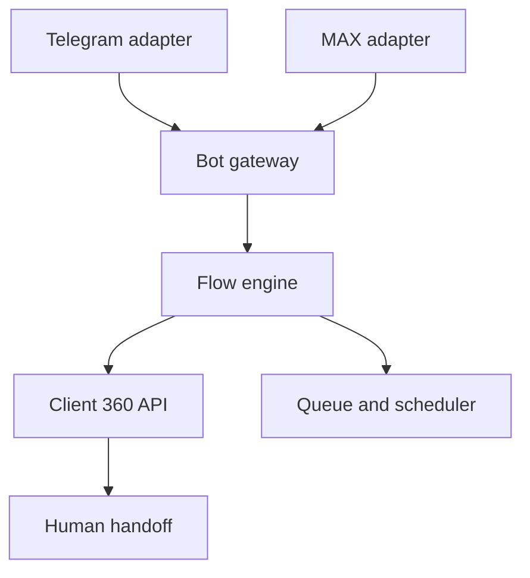

# 50. Техническое задание на чат-ботов LANGUST

Статус: проект с нуля  
Платформы: Telegram и MAX  
Зависимость: Client 360  

## 1. Цель

Бот не должен быть длинной автоматической презентацией. Его задача — быстро понять ситуацию родителя, дать один полезный результат, создать пробный доступ, сопровождать по поведению ребёнка и передать человеку нестандартный вопрос.

Основной результат:

`источник → старт бота → релевантный маршрут → заявка → пробник → первый результат → оплата → onboarding`.

## 2. Принципы

1. Одна реплика — одна задача.
2. Кнопки важнее свободного текста там, где варианты известны.
3. Всегда доступна кнопка «Позвать человека».
4. Бот не притворяется Татьяной.
5. Никаких выдуманных дедлайнов и «последних шансов».
6. Продажа начинается после пользы или подтверждённого опыта.
7. Состояние общее с Client 360: бот не создаёт параллельную CRM.
8. Telegram и MAX используют одну бизнес-логику, но разные adapters.
9. Согласие на сообщения в конкретном боте не равно согласию на email.
10. Ребёнок не должен самостоятельно передавать персональные данные; диалог адресован родителю.

## 3. Пользовательские маршруты

### BOT-ROUTE-01. Холодный вход

Родитель приходит из Reels, рекламы, сайта, QR или поста. Бот определяет класс и проблему, даёт микроразбор и предлагает 3 пробных дня.

### BOT-ROUTE-02. Горячая заявка

Родитель уже хочет пробник. Бот собирает минимум данных, фиксирует согласия, создаёт заявку и подтверждает следующий шаг.

### BOT-ROUTE-03. Существующий пробник

Бот помогает найти доступ, выбрать текущую тему, исправить вход и получить первый результат.

### BOT-ROUTE-04. Покупатель

Показывает доступ, помощь, текущий курс, поддержку, предпочтения и отчёт. Повторно не продаёт уже купленный курс.

### BOT-ROUTE-05. Поддержка

Классифицирует проблему, собирает безопасные детали, создаёт case и передаёт человеку.

## 4. Команды и главное меню

Минимум:

- `/start` — вход или продолжение;
- `/course` — открыть курс/пробник;
- `/progress` — отчёт родителю при безопасной авторизации;
- `/help` — помощь и человек;
- `/settings` — согласия и уведомления;
- `/privacy` — данные и запросы;
- `/stop` — остановить маркетинговые сообщения бота.

Главное меню кнопками:

- «Попробовать 3 дня»;
- «Уже есть доступ»;
- «Помощь»;
- «Мои настройки».

## 5. Идентификация

### BOT-ID-01

Платформенный user/chat ID хранится в `channel_identity` и связывается с guardian только после подтверждения.

### BOT-ID-02

Нельзя считать имя профиля подтверждённым ФИО.

### BOT-ID-03

Связывание существующей семьи выполняется через короткий одноразовый link/code, отправленный на уже подтверждённый канал, либо через безопасный вход в кабинет.

### BOT-ID-04

Один Telegram/MAX аккаунт может быть связан только с разрешёнными семьями. Изменение связи аудируется.

## 6. Данные

Бот хранит минимум:

- platform;
- platform user/chat ID;
- internal guardian/family ID после связывания;
- текущий flow/state;
- start/deep-link parameter;
- campaign/source;
- выбранный класс, учебник и проблема;
- timestamps действий;
- consent records;
- handoff status;
- platform message IDs;
- delivery/error status;
- безопасный conversation summary.

Не хранить в state:

- bot token;
- пароль родителя;
- полный платёжный реквизит;
- фотографии документов;
- медицинские данные;
- полный текст каждого сообщения бессрочно без цели.

## 7. Архитектура

Компоненты:

- platform adapters;
- webhook gateway;
- update deduplication;
- flow/state engine;
- message template registry;
- scheduler;
- Client 360 connector;
- human handoff queue;
- observability;
- admin preview/dry run.

Физическая модель расширения: [`chatbot-schema.sql`](chatbot-schema.sql).

## 8. Webhooks

### BOT-WH-01

Production использует HTTPS webhook. Long polling допустим только локально или как временный диагностический режим.

### BOT-WH-02

Telegram webhook проверяет `X-Telegram-Bot-Api-Secret-Token`. Telegram не должен одновременно работать через webhook и `getUpdates`. Официальное описание: [setWebhook](https://core.telegram.org/bots/api#setwebhook).

### BOT-WH-03

MAX adapter использует текущий API endpoint из конфигурации. На 21 сентября 2026 официальный домен — `platform-api2.max.ru`; токен передаётся только заголовком `Authorization`. Официальное описание: [MAX API](https://dev.max.ru/docs-api).

### BOT-WH-04

Каждый update дедуплицируется по platform update/message/callback ID. Ответ платформе быстрый; бизнес-обработка уходит в очередь.

### BOT-WH-05

Неизвестный тип update логируется без PII и не ломает обработчик.

## 9. Кнопки и callback

### BOT-UI-01

Callback data содержит короткий непрозрачный action ID, а не email, телефон, цену или свободный текст.

### BOT-UI-02

Повторное нажатие безопасно и идемпотентно.

### BOT-UI-03

Истёкшая кнопка отвечает понятным сообщением и строит актуальное меню.

### BOT-UI-04

Основной flow проектируется на общем знаменателе Telegram/MAX: текст, изображение при необходимости, кнопки, URL и callback. Платформенные улучшения не ломают общий маршрут.

## 10. Deep links и атрибуция

### BOT-ATTR-01

Для каждого источника создаётся короткий непрозрачный start code, связанный на сервере с campaign/source/content.

### BOT-ATTR-02

В start parameter не помещается PII. Для Telegram учитывается ограниченный допустимый набор символов и длина параметра.

### BOT-ATTR-03

Сохраняются first bot touch и last bot touch, но заявка не дублируется при повторном `/start`.

### BOT-ATTR-04

QR, Reels, сторис, лендинг и партнёр получают разные codes.

## 11. Human handoff

### BOT-HO-01

Триггеры передачи:

- пользователь просит человека;
- свободный вопрос не распознан;
- login/payment/refund/privacy/complaint;
- ребёнку трудно и нужен разбор урока;
- низкая confidence;
- повторная ошибка;
- агрессия или distress;
- обещание сотрудника.

### BOT-HO-02

При передаче создаётся support case с summary, выбранными ответами, последними релевантными сообщениями, приоритетом и SLA.

### BOT-HO-03

Бот сообщает реальный режим ответа и не обещает «через минуту», если человек недоступен.

### BOT-HO-04

Пока case открыт, sales flow на паузе. После ответа человек явно возвращает диалог автоматике или закрывает её.

## 12. Сообщения и шаблоны

Каждый шаблон содержит:

- `template_key`;
- platform variants;
- flow/state;
- purpose;
- text;
- media reference;
- buttons;
- variables;
- required consent;
- allowed hours;
- expiry;
- version;
- owner;
- status.

Переменные проходят escaping для конкретной платформы. URL создаются через approved link builder.

## 13. Планировщик

### BOT-SCH-01

Отложенное сообщение перед отправкой повторно проверяет state, покупку, support hold, consent, suppression, frequency cap и актуальность оффера.

### BOT-SCH-02

Лимит бот-сообщений учитывается вместе с email/WhatsApp в Client 360. Каналы не должны одновременно дублировать одну задачу.

### BOT-SCH-03

Quiet hours используют timezone семьи. Если timezone неизвестен, применяется консервативное окно по кампании.

### BOT-SCH-04

Каждое сообщение имеет reason, source event, scheduled time, cancellation reason и delivery status.

## 14. Согласия и остановка

### BOT-CON-01

Начало диалога разрешает ответить на запрос пользователя, но не автоматически подписывает на любые будущие акции.

### BOT-CON-02

Перед регулярными маркетинговыми сообщениями бот показывает назначение, частоту и простой отказ.

### BOT-CON-03

`/stop`, кнопка «Не присылать предложения» и свободный текст с явным отказом создают suppression.

### BOT-CON-04

Сервисные ответы на активный запрос отделены от маркетинга.

## 15. Безопасность

### BOT-SEC-01

Токены только в secret manager, отдельные для staging/production, с ротацией и журналом владельца.

### BOT-SEC-02

Webhook URL не содержит bot token. Логи маскируют headers, IDs и текст.

### BOT-SEC-03

Rate limiting по IP, platform user и action. Защита от callback replay и message flood.

### BOT-SEC-04

Администраторские команды доступны только allowlist и дополнительно проверяются на backend. Лучше не управлять кампанией через публичный бот.

### BOT-SEC-05

Файлы сканируются, ограничиваются по размеру/типу и не открываются оператором напрямую из непроверенного URL.

## 16. События

Минимум:

- `bot_started`;
- `bot_start_source_resolved`;
- `bot_menu_viewed`;
- `bot_button_clicked`;
- `bot_question_answered`;
- `bot_lead_magnet_opened`;
- `bot_trial_requested`;
- `bot_identity_linked`;
- `bot_handoff_requested`;
- `bot_handoff_started`;
- `bot_handoff_resolved`;
- `bot_message_queued/sent/delivered/failed`;
- `bot_marketing_opted_in/out`;
- `bot_blocked` при доступном сигнале платформы;
- `bot_flow_completed/abandoned`.

События продукта, оплаты и пробника остаются общими с Client 360.

## 17. Метрики

- start → первый выбор;
- первый выбор → микроценность;
- микроценность → запрос пробника;
- запрос → созданный доступ;
- доступ → first login;
- first login → first value;
- first value → engaged;
- engaged → checkout;
- checkout → payment;
- handoff rate и resolution;
- opt-out, block и complaint;
- ошибки платформы;
- конверсия по source code и платформе.

## 18. Админ-интерфейс

Показывает:

- реестр ботов без секретов;
- статус webhook/subscription;
- версию flow и шаблонов;
- последние ошибки;
- очередь handoff;
- диалоги с маскированием;
- scheduled messages;
- dry run;
- kill switch по платформе/flow/campaign;
- статистику;
- аудит изменений.

## 19. Приёмочные сценарии

1. Повторный `/start` не создаёт дубль семьи.
2. Разные deep links корректно сохраняют источник.
3. Пользователь 3 класса не получает оффер 2 класса.
4. Отказ мгновенно отменяет scheduled marketing.
5. Покупка отменяет trial offer в обоих ботах.
6. Открытый support case блокирует продажи.
7. Истёкшая кнопка возвращает актуальное меню.
8. Повторный callback не создаёт две заявки.
9. Неверная подпись/секрет webhook отклоняется.
10. Ошибка API повторяется с backoff без дубля сообщения.
11. Handoff создаёт case и виден Гузель.
12. Staging не отправляет реальному пользователю вне allowlist.
13. Токен не появляется в коде, логах, ошибке или аудите.
14. Отключение платформы не ломает Client 360 и второй бот.
15. Flow можно возобновить после паузы с актуального state.

## 20. Definition of Done

- инвентарь и ownership подтверждены;
- токены ротированы и защищены;
- staging работает на тестовых ботах;
- common flow не зависит от платформы;
- webhook защищён и наблюдаем;
- Client 360 получает события;
- handoff проверен человеком;
- consent/suppression работают;
- dry run и kill switch проверены;
- все 15 сценариев проходят;
- владелец одобрил тексты и production release.
