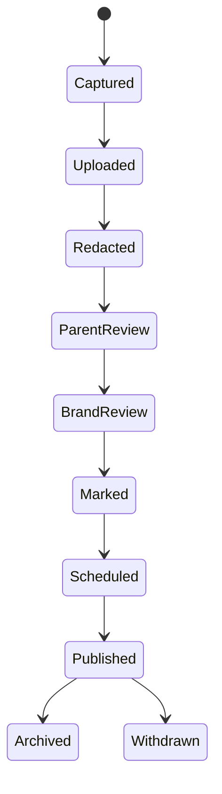

# 52. UGC-программа «Я сам!»: учебное реалити LANGUST

Статус: концепция и продуктовая спецификация  
Рабочее название: «Я сам!»  
Формат: публичная история обучения + контент креатора + подтверждённая аналитика  

## 1. Идея

Семья не записывает один постановочный отзыв после покупки. Она в течение согласованного периода показывает реальный путь ребёнка:

- с чего начинали;
- где ребёнку было трудно;
- как проходило первое занятие;
- что он начал делать самостоятельно;
- как менялось количество помощи родителя;
- что переносилось в школьный Spotlight;
- какие вопросы и ограничения остались.

На сайте LANGUST появляется публичная карточка участника с аватаром, серией эпизодов и накопленной историей. У креатора эта же история оформляется как постоянная рубрика и набор кругов «Актуальное».

Это должно создавать доверие не за счёт идеальной картинки, а за счёт последовательности и проверяемых наблюдений.

## 2. Что продаёт реалити

Не «ребёнок стал отличником за неделю», а более честные изменения:

- понял, где искать нужный урок;
- смог пройти одно упражнение без объяснения мамы;
- вернулся к занятию второй раз;
- узнал слова в новом задании;
- стал реже звать взрослого;
- открыл школьную тему без страха;
- родитель понял, где именно ребёнок застревает.

Главная драматургия: **от «мама объясняет каждый шаг» к «ребёнок постепенно ориентируется сам»**.

## 3. Почему это не обычный отзыв

| Обычный отзыв | Учебное реалити |
|---|---|
| один итоговый текст | последовательность эпизодов |
| память задним числом | наблюдения по ходу процесса |
| только успех | успехи, сложности и помощь |
| нет контекста | класс, учебник, тема и период |
| сложно проверить | события продукта + слова родителя |
| быстро устаревает | формируется база кейсов |

## 4. Публичная карточка ребёнка

По умолчанию используется иллюстрированный аватар, а не лицо. Публичное имя — псевдоним или только имя с разрешения родителя.

### Первый экран

- аватар;
- display name;
- «2 класс · Spotlight» без школы и населённого пункта;
- короткая цель семьи;
- номер недели участия;
- последний опубликованный эпизод;
- CTA «Попробовать 3 дня» с creator attribution;
- пояснение, что история публикуется с разрешения родителя.

### Круги как «Актуальное»

1. `Старт` — исходная ситуация и цель.
2. `Первая неделя` — знакомство с форматом.
3. `Слова` — как ребёнок запоминает лексику.
4. `Spotlight` — работа с текущей школьной темой.
5. `Я сам!` — моменты самостоятельности.
6. `Маме легче` — наблюдения родителя.
7. `Результаты` — подтверждённые вехи.
8. `Честно` — трудности и что не получилось.
9. `Вопросы` — ответы на частые вопросы аудитории.

Необязательно показывать все круги сразу. Пустой круг не публикуется.

### Лента прогресса

Карточки эпизодов:

- дата или «Неделя 2» без точного расписания ребёнка;
- тема;
- короткий ролик/сторис/фото;
- наблюдение родителя;
- подтверждённое событие продукта, если уместно;
- «что попробуем дальше»;
- отметка рекламы там, где она требуется.

### Метрики на публичной странице

Разрешено показывать только согласованные и понятные показатели:

- число учебных сессий за опубликованный период;
- число активных дней;
- завершённые темы;
- конкретная веха;
- самооценка родителя «сколько раз потребовалась помощь» как субъективное наблюдение.

Не показывать:

- точное время входа;
- расписание и местоположение;
- рейтинг среди детей;
- ошибки по каждому заданию;
- прогноз способностей;
- оплату семьи;
- сообщения поддержки;
- точный возраст и дату рождения;
- школу, класс с буквой и учителя.

## 5. Не настоящий realtime ребёнка

Публичная страница обновляется после модерации и с задержкой, а не сразу после каждого действия.

Рекомендуемая задержка: 24–72 часа. Причины:

- безопасность ребёнка;
- возможность родителю передумать;
- удаление случайных персональных деталей;
- проверка заявления о результате;
- рекламная маркировка;
- защита от публикации эмоционального эпизода, о котором семья пожалеет.

Кабинет креатора может получать операционные события быстрее, но публичный профиль — только curated publication.

## 6. Форматы эпизодов

### Короткая сторис

15–30 секунд: один момент, одно наблюдение, одна подпись.

### Серия сторис

3–5 кадров:

1. ситуация;
2. действие ребёнка;
3. реакция;
4. наблюдение родителя;
5. следующий шаг или честный CTA.

### Недельный Reel

30–60 секунд:

- что проверяли;
- один реальный фрагмент;
- что изменилось;
- что всё ещё трудно;
- приглашение посмотреть путь/пробник.

### Месячный кейс

- исходная точка;
- период;
- 2–3 подтверждённых наблюдения;
- ограничение контекста;
- вывод родителя;
- ссылка на всю историю.

## 7. Сезоны и эпизоды

### Сезон 1. «Первые 30 дней»

| Неделя | Сюжет | Доказательство |
|---|---|---|
| 0 | что происходит с английским сейчас | baseline родителя |
| 1 | может ли ребёнок войти и понять порядок | first login / first value |
| 2 | слова: узнаёт ли их в разных заданиях | повторная практика |
| 3 | связь с текущим Spotlight | выбранный модуль / урок |
| 4 | стало ли меньше помощи взрослого | дневник родителя + активность |

### Сезон 2. «Школьная тема»

Одна тема Spotlight проходит путь от первого объяснения до школьной домашней работы.

### Сезон 3. «Каникулы без перегруза»

Короткие занятия, возвращение после паузы и сохранение привычки.

### Сезон 4. «Новый учебный год»

Переход в следующий класс, новая программа и самостоятельный выбор урока.

## 8. Рубрика креатора

У креатора должны быть те же смысловые круги, что на сайте, чтобы аудитория узнавала сериал на разных площадках.

Рекомендуемые названия «Актуального»:

- `Старт`;
- `Неделя 1`;
- `Spotlight`;
- `Слова`;
- `Я сам!`;
- `Честно`;
- `Итоги`;
- `LANGUST`.

Кабинет выдаёт:

- обложки и визуальные правила;
- ближайший сюжетный вопрос;
- список разрешённых утверждений;
- обязательную маркировку;
- персональную tracked link;
- актуальный промокод;
- дедлайн материала;
- статус проверки и публикации.

## 9. Контентный ритм пилота

Для первого креатора:

- 2–3 короткие сторис в неделю;
- 1 недельный Reel;
- 1 обновление публичной карточки в неделю;
- 1 честный итог месяца;
- вопросы аудитории собираются постоянно, но публикуются агрегированно.

Не требовать съёмку каждого занятия. Ребёнок не должен постоянно чувствовать камеру.

## 10. Производственный процесс

### Состояния

- `captured` — снято, но никуда не загружено;
- `uploaded` — оригинал в закрытом хранилище;
- `redaction_required` — нужно убрать личные детали;
- `parent_review` — родитель подтверждает конкретный материал;
- `brand_review` — проверка фактов, тона, ссылок;
- `legal_marking` — реклама/erid/данные рекламодателя;
- `approved`;
- `scheduled`;
- `published`;
- `expired`;
- `withdrawn`;
- `rejected`.

## 11. Модерация

Автоматические проверки:

- лица посторонних детей;
- документы, номера, школа, геолокация;
- телефон/email на экране;
- имя учителя;
- пароли и кабинет;
- музыка/материалы без прав;
- запрещённые обещания;
- отсутствие маркировки;
- устаревшая цена;
- неактивная tracked link.

Финальное решение принимает человек.

## 12. Тон

Правильно:

- «Сегодня Настя сама нашла нужное упражнение»;
- «На чтении ещё просит помощи»;
- «Это наблюдение одной семьи, результат у детей различается»;
- «Проверяем, станет ли школьная тема понятнее».

Неправильно:

- «Ваш ребёнок гарантированно станет отличником»;
- «LANGUST вылечил дислексию»;
- «Все дети занимаются сами»;
- «Мама больше никогда не нужна»;
- постановочная слеза или унижение;
- скрытая реклама под видом случайной семейной истории.

## 13. Где публикуется

- публичная карточка/раздел сайта LANGUST;
- соцсеть креатора;
- официальный аккаунт LANGUST;
- email/бот только в объёме разрешения;
- платная реклама — только при отдельной лицензии и согласии;
- презентации/лендинги — только если перечислены в разрешении.

Для индивидуальной детской страницы рекомендуется `noindex, noarchive`; индексируемый кейс лучше собирать отдельно и сильнее анонимизировать.

## 14. Принцип достоверности

В каждом эпизоде разделяются:

1. факт системы;
2. наблюдение родителя;
3. слова ребёнка;
4. интерпретация LANGUST;
5. маркетинговый CTA.

Они не должны сливаться в заявление «система доказала причинность».

## 15. Успех пилота

Пилот успешен, если:

- семья не пожалела об участии;
- нет privacy/security-инцидентов;
- опубликовано минимум четыре содержательных эпизода;
- аудитория досматривает историю и задаёт релевантные вопросы;
- tracked audience доходит до пробника и first value;
- creator ledger сходится с оплатами/возвратами;
- контент создаётся без давления на ребёнка;
- из пилота получается повторяемый шаблон для следующих семей.
