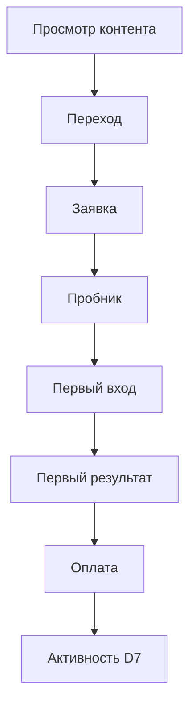

# 53. Личный кабинет UGC-креатора

Статус: техническое задание  
Основная задача: дать креатору прозрачность, материалы и полезные рекомендации без раскрытия данных семей  

## 1. Роли

### Creator

Видит только собственные каналы, контент, агрегированную воронку, начисления, выплаты, рекомендации и разрешённые данные участника реалити.

### Creator manager

Видит назначенных креаторов, проверяет материалы, briefs, права и вопросы.

### Finance owner

Подтверждает базу начисления, возвраты, документы и выплаты.

### Privacy/content reviewer

Проверяет детский контент, разрешения, redaction, срок использования и снятие.

### Owner — Татьяна

Утверждает договор, модель 50/50, креатив, оффер, спорную атрибуцию и выплату.

## 2. Навигация

1. Обзор.
2. Моя воронка.
3. Контент и эпизоды.
4. Публичная история ребёнка.
5. Вопросы аудитории.
6. Рекомендации.
7. Промокод и ссылки.
8. Начисления и выплаты.
9. Документы и права.
10. Уведомления.
11. Помощь.

## 3. Главный экран

### Верхние карточки

- переходы по tracked links;
- уникальные посетители;
- заявки;
- созданные пробники;
- first login;
- first value;
- оплаты;
- подтверждённая чистая база;
- предварительная доля креатора;
- доступно к выплате.

Каждая цифра имеет:

- период;
- время последнего обновления;
- статус точности;
- tooltip с формулой;
- сравнение только с собственным предыдущим периодом.

### Статусы денег

- `предварительно` — платёж прошёл, действует hold;
- `подтверждено` — hold завершён, расхождений нет;
- `к выплате` — включено в statement;
- `выплачено`;
- `возврат/корректировка`;
- `спор`.

Нельзя показывать предварительную сумму как уже заработанную и доступную.

## 4. Воронка креатора

Креатор видит:

- абсолютные числа;
- переходы между этапами;
- конверсии;
- медианное время перехода;
- разбивку по площадке, материалу, ссылке и промокоду;
- размер выборки;
- объяснение неполной атрибуции.

Креатор не видит:

- ФИО покупателя;
- email, телефон, город точнее разрешённой агрегации;
- имя ребёнка;
- платёжный ID и чек;
- историю занятий конкретной чужой семьи;
- свободный текст личного обращения;
- IP, ClientID/UserID и raw UTM на уровне человека.

## 5. Реальное время и задержки

| Данные | Ожидаемая задержка | Источник |
|---|---:|---|
| переход по tracked link | секунды–минуты | first-party collector |
| заявка | минуты | Client 360 |
| trial/first login/first value | минуты | платформа событий |
| платёж | после подтверждённого webhook | Robokassa |
| возврат | после подтверждённого webhook/сверки | Robokassa |
| Яндекс Метрика | часы или дольше | аналитическая сверка |
| комиссия к выплате | после hold и сверки | commission ledger |

Слово «онлайн» в интерфейсе означает near-real-time операционную ленту, а не окончательный бухгалтерский расчёт.

## 6. Контент

Для каждого материала:

- brief;
- формат;
- площадка;
- child/creator asset references;
- draft/upload;
- права;
- маркировка;
- tracked link;
- промокод;
- scheduled/published URL;
- статистика;
- вывод;
- следующая рекомендация.

Креатор загружает оригинал в закрытое хранилище. Preview может иметь watermark. Публичная публикация использует одобренную производную версию.

## 7. Публичная история ребёнка

Креатор видит:

- аватар и выбранный display name;
- состояние разрешений;
- список кругов;
- черновики эпизодов;
- preview страницы;
- что требует родительского подтверждения;
- что опубликовано;
- срок прав;
- кнопку запроса снятия/изменения.

Опубликовать материал самостоятельно без required approvals нельзя.

## 8. Вопросы аудитории

Отображаются только:

- агрегированные темы;
- количество;
- доля от диалогов;
- динамика;
- несколько вручную обезличенных формулировок;
- связь с конкретным контентом;
- conversion after question в агрегате.

Минимальный порог для автоматического кластера — например 5 разных пользователей. На меньшей выборке показывать «данных недостаточно».

Темы:

- цена;
- что входит;
- как получить доступ;
- подходит ли класс;
- совпадает ли со Spotlight;
- нужно ли сидеть рядом;
- сколько времени;
- безопасность оплаты;
- возврат;
- техническая проблема;
- другое.

Частые вопросы не означают автоматически, что креатор «плохо объясняет». Это может быть высокий интерес, слабый лендинг, неясный оффер или технический барьер.

## 9. Рекомендации

Каждая рекомендация содержит:

- наблюдение;
- этап воронки;
- размер выборки;
- уверенность;
- возможные альтернативные причины;
- предложенный тип контента;
- один измеримый тест;
- срок пересмотра;
- ограничения и guardrails.

Пример:

> 31% вопросов после Reel относятся к тому, что входит в годовой доступ. Выборка: 26 диалогов. Гипотеза: условия показаны поздно или слишком общо. Снимите короткую сторис «что ребёнок получает после пробника» и используйте ту же tracked link. Не меняйте одновременно цену и CTA.

## 10. Уведомления

Настройки по каналам и частоте.

События:

- материал принят/нужна правка;
- права или erid скоро истекают;
- новый эпизод опубликован;
- достигнут порог просмотров/заявок;
- подтверждённая оплата;
- возврат/корректировка;
- statement готов;
- выплата отправлена;
- новый кластер вопросов;
- рекомендация готова;
- проблема атрибуции;
- документ/чек отсутствует.

Уведомление об оплате:

> Новая подтверждённая оплата из вашей атрибуции: 7 900 ₽. Предварительная расчётная база и доля появятся после сверки. Покупатель не раскрывается.

Уведомление о возврате:

> По одной атрибутированной покупке зарегистрирован возврат. Предварительная доля скорректирована согласно условиям программы. Подробности — в строке ledger без данных клиента.

## 11. Финансы

Экран показывает:

- order alias;
- дата;
- продукт;
- gross paid;
- refund;
- разрешённые вычеты по договору;
- commissionable base;
- share rate;
- creator amount;
- hold until;
- status;
- statement/payout;
- adjustment reason;
- dispute deadline.

Формула видна построчно. Ручная корректировка имеет автора, причину и приложенное доказательство.

## 12. Споры

Креатор может оспорить:

- непривязанную оплату;
- неверный промокод;
- возврат;
- вычет;
- сумму;
- пропущенный материал;
- статус выплаты.

Спор создаёт case, замораживает конкретную строку, но не всю программу. Срок ответа и решение журналируются.

## 13. Доступ и безопасность

- 2FA;
- только собственный creator scope;
- запрет угадываемых IDs;
- серверная проверка tenant/creator ID;
- аудит просмотра финансов;
- ограниченный export;
- signed URLs для файлов;
- автоматический logout;
- отзыв устройств;
- скрытие данных при screen sharing mode;
- запрет токенов/API keys в интерфейсе.

## 14. Мобильный интерфейс

На телефоне приоритет:

- сегодняшняя рекомендация;
- загрузить материал;
- статус проверки;
- краткая воронка;
- последняя оплата/возврат без PII;
- доступно к выплате;
- вопрос менеджеру.

Сложная атрибуция и документы могут открываться в desktop view.

## 15. Экспорт

Креатор может экспортировать собственный агрегированный отчёт и statement. Raw visitor-level data, ClientID, контакты и чужие вопросы не экспортируются.

## 16. Приёмка

1. Креатор A не может открыть данные креатора B через URL/API.
2. Оплата появляется как provisional, а не payable.
3. Возврат создаёт понятную adjustment line.
4. Сумма statement воспроизводится из ledger.
5. Creator не видит покупателя.
6. Воронка различает click, lead, trial, first value и payment.
7. Метрики показывают задержку и источник.
8. Рекомендация содержит sample size и альтернативные причины.
9. Кластер вопросов ниже privacy threshold скрыт.
10. Asset нельзя опубликовать без прав и маркировки.
11. Отзыв разрешения снимает asset по workflow.
12. Все финансовые и правовые действия аудируются.
