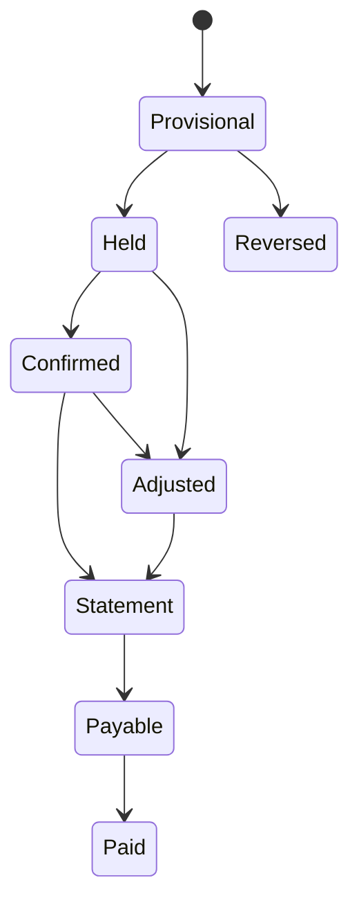

# 54. UGC-атрибуция и разделение дохода 50/50

Статус: рекомендуемая модель для договора и разработки  
Важно: финансовую, налоговую и рекламную модель проверить с бухгалтером и юристом до первой выплаты  

## 1. Почему нельзя написать просто «прибыль пополам»

Слово «прибыль» может означать:

- сумму оплаты покупателя;
- оплату минус скидка;
- оплату минус возврат;
- оплату минус эквайринг и налог;
- маржинальную прибыль;
- операционную прибыль после зарплат и подписок.

Если формулу не зафиксировать заранее, кабинет будет показывать цифру, с которой одна сторона не согласится.

## 2. Рекомендуемая база

Использовать термин `commissionable_net_receipts` — подтверждённые чистые поступления, относимые к креатору.

Рекомендуемая формула:

```text
gross_cash_received
- customer_refunds
- chargebacks
- payment_provider_fee
- taxes_directly_tied_to_this_sale, если это явно закреплено договором
= commissionable_net_receipts

creator_share = commissionable_net_receipts × 50%
```

Скидка уже учтена в фактически полученной сумме. Постоянные расходы LANGUST — зарплата, Tilda, ProgressMe, OpenAI и другие подписки — не вычитать из базы креатора, если договор не содержит прозрачной заранее известной модели. Иначе креатор не сможет проверить расчёт.

Альтернатива для ещё более простого пилота: 50% от оплаты после возвратов, без вычета комиссии и налога. Она проще для доверия, но дороже для LANGUST. Выбрать одну модель до запуска.

## 3. Состояния начисления



- `provisional` — payment webhook подтверждён, атрибуция ещё проверяется;
- `held` — действует период возврата/антифрода;
- `confirmed` — база и атрибуция подтверждены;
- `statement` — строка вошла в расчётный акт;
- `payable` — документы готовы;
- `paid` — выплата подтверждена;
- `reversed` — полный возврат до подтверждения;
- `adjusted` — частичный возврат или исправление;
- `disputed` — строка временно заморожена.

## 4. Период удержания

`hold_days` задаётся договором и продуктом. Для пилота можно использовать 14 или 30 дней, но срок должен учитывать фактическую политику возвратов.

Креатор видит платёж сразу как provisional, но сумма не становится payable до окончания hold и сверки.

Если возврат случился после выплаты:

- создаётся отрицательная adjustment line;
- она переносится на следующий statement;
- автоматическое списание денег со счёта креатора без договорного основания запрещено;
- при прекращении сотрудничества применяется договорный порядок финального расчёта.

## 5. Объект атрибуции

Атрибуция привязывает не «пользователя вообще», а конкретный `order/payment` к `creator_id`, `creator_campaign_id` и версии правил.

Для каждой заявки и оплаты сохраняются:

- first touch;
- last eligible creator touch;
- promo code;
- signed referral link;
- creator landing code;
- self-reported source;
- assisted creator touches;
- attribution decision;
- rule version;
- evidence references;
- confidence;
- manual override с аудитом.

## 6. Иерархия правил

Рекомендуемый приоритет:

1. Валидный creator promo code, введённый при покупке.
2. Подписанная creator link, связанная с lead/account в окне атрибуции.
3. Последнее допустимое creator touch в first-party истории.
4. Подтверждённый self-reported creator — только ручное решение.
5. Нет достаточного доказательства — unattributed, а не случайное назначение.

Промокод и ссылка могут подтверждать друг друга. Если они относятся к разным креаторам, создаётся conflict case.

## 7. Окно

До запуска фиксируется:

- lead window, например 7 дней;
- purchase window, например 30 дней;
- return/revisit window;
- правило cross-device;
- правило повторной покупки;
- правило продления.

Нельзя менять окно после просмотра результатов кампании.

Рекомендуемый пилот:

- заявка: 7 дней после creator touch;
- первая покупка: 30 дней;
- промокод при покупке: override внутри срока кампании;
- продление: отдельное решение, не автоматически пожизненная комиссия.

## 8. Повторная покупка и LTV

В договоре выбрать одно:

- комиссия только с первого заказа;
- комиссия со всех оплат конкретного продукта в течение N месяцев;
- комиссия с renewal в период активного creator agreement;
- отдельный процент для renewal.

Для пилота безопаснее первая подтверждённая покупка плюс явно определённое первое продление. «Пожизненная доля» создаёт сложный долгосрочный долг и споры о последующих источниках.

## 9. Несколько креаторов

По умолчанию одна продажа создаёт одну commission owner:

- promo code выигрывает;
- иначе last eligible creator touch;
- остальные сохраняются как assisted;
- split между креаторами возможен только отдельным правилом.

Креатор видит число assisted conversions отдельно, но они не превращаются в деньги без договорного основания.

## 10. Промокоды

Промокод — не персональные данные и не секрет, если он публичный.

Поля:

- code;
- creator_id;
- offer_id;
- discount;
- active from/until;
- usage limits;
- allowed products;
- new-customer restriction;
- stacking rules;
- attribution priority;
- fraud rules;
- terms version.

Не помещать ФИО креатора в UTM. Использовать устойчивый непрозрачный `creator_campaign_id`.

## 11. UTM-стандарт

Пример:

```text
utm_source=instagram
utm_medium=creator_ugc
utm_campaign=ugc_reality_pilot_2026
utm_content=week_02_words_reel
utm_term=spotlight_2
creator_campaign_id=crp_a7k2
```

Разные публикации получают разные `utm_content` и signed tracked links.

## 12. First-party tracking

При клике сервер:

1. разрешает signed link;
2. создаёт `creator_touch_id`;
3. сохраняет campaign/content/platform;
4. записывает first-party cookie при разрешении;
5. сохраняет server-side touch;
6. передаёт посетителя на чистый landing URL;
7. при заявке связывает touch с lead;
8. при оплате делает attribution decision.

Нельзя полагаться только на cookie: блокировки, другой браузер и другое устройство разрывают путь.

## 13. Яндекс Метрика

Использовать для:

- UTM-отчётов;
- поведения на странице;
- целей;
- ClientID/UserID при допустимом основании;
- e-commerce сверки;
- агрегированных разрезов контента.

Не использовать как единственный источник:

- подтверждения платежа;
- расчёта комиссии;
- точной cross-device идентичности;
- мгновенных уведомлений.

Яндекс указывает, что ClientID относится к браузеру, а собственный UserID можно передавать отдельно; e-commerce передаётся через `dataLayer`, а данные в отчётах появляются с задержкой. Источники: [ClientID/UserID](https://yandex.ru/support/metrica/ru/general/clientid-userid), [E-commerce](https://yandex.com/support/metrica/en/data/e-commerce), [UTM](https://yandex.com/support/metrica/en/reports/tags-utm).

В Метрику передаётся внутренний псевдонимный UserID, не email/телефон/имя ребёнка.

## 14. События сайта

Минимум:

- `creator_link_clicked`;
- `ugc_profile_viewed`;
- `ugc_highlight_opened`;
- `ugc_episode_viewed`;
- `ugc_video_started`;
- `ugc_video_completed`;
- `ugc_cta_clicked`;
- `trial_form_started`;
- `lead_created`;
- `trial_created`;
- `first_login`;
- `first_activity_completed`;
- `checkout_started`;
- `payment_succeeded`;
- `payment_refunded`.

Событие хранит creator campaign/content IDs, но не имя ребёнка.

## 15. Антифрод

Проверки:

- self-referral;
- повторные оплаты одной семьи;
- промокод после уже начатой оплаты;
- массовые клики без сессий;
- bot traffic;
- циклические возвраты;
- creator и buyer с совпадающими платёжными/контактными признаками;
- купоны на неразрешённых площадках;
- конфликт нескольких creator codes;
- ручное изменение source после покупки.

Флаг не означает виновность. Он создаёт review и замораживает конкретную commission line.

## 16. Statement и выплата

Statement содержит:

- период;
- agreement/version;
- opening balance;
- подтверждённые строки;
- adjustments;
- refunds;
- creator share;
- налоги/удержания по выбранной правовой модели;
- payable amount;
- closing balance;
- dispute deadline;
- status и подписи/подтверждение.

Рекомендуемый ритм: monthly statement + выплата после принятия документов.

## 17. Статус креатора и документы

До первой выплаты определить:

- физлицо / самозанятый / ИП / юрлицо;
- тип договора;
- услуги создания/размещения контента;
- лицензия на материалы;
- порядок чеков/актов;
- налоги и удержания;
- рекламные обязанности;
- права на изображение ребёнка;
- порядок возвратов и споров.

ФНС указывает, что самозанятый должен формировать чек на полученную оплату. При работе с обычным физлицом у заказчика могут возникать обязанности налогового агента и по страховым взносам. Конкретную модель проверить у бухгалтера; revenue share не должен маскировать трудовые отношения или запрещённую агентскую схему.

## 18. Маркировка рекламы

UGC с промокодом, ссылкой и вознаграждением следует проектировать как рекламу, пока юридическая проверка не докажет иное.

Для каждого размещения хранить:

- advertiser;
- advertising distributor;
- creator/channel;
- agreement;
- creative ID/version;
- platform/post URL;
- erid;
- label text;
- publication time;
- impressions/reporting data;
- OРД submission status;
- correction/withdrawal.

ФАС публикует примеры интернет-рекламы, подлежащей маркировке, а Роскомнадзор — рекомендации по `erid` и ЕРИР: [ФАС](https://fas.gov.ru/pages/primery-reklamy-v-internete-podlezhaschey-markirovke), [Роскомнадзор](https://rkn.gov.ru/activity/register-ord/recommendations/).

## 19. Приёмка расчётов

1. Каждая сумма воспроизводится из payment/refund/fee ledger.
2. Ручная корректировка имеет автора и причину.
3. Promo code conflict не решается молча.
4. Возврат меняет commission status.
5. Метрика не может создать payment.
6. Creator не видит PII покупателя.
7. Rule version сохраняется на строке.
8. Окончание кампании не переписывает старые решения.
9. Statement равен сумме подтверждённых ledger lines.
10. Нельзя выплатить без agreement и требуемых документов.
