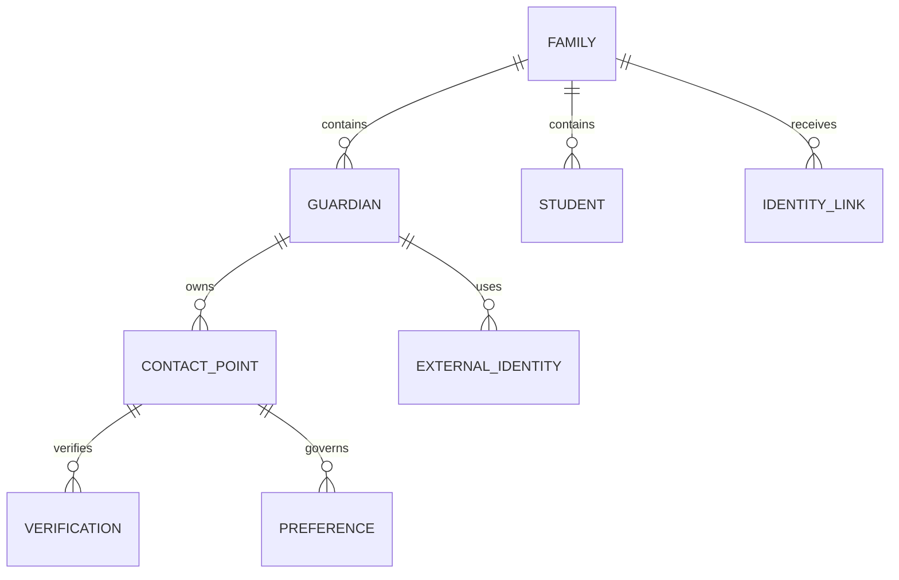

# 58. Контакты, личности и единая карточка семьи

## Назначение

Этот документ задаёт каноническую модель всех контактов клиента. Его задача — не собрать максимум сведений, а обеспечить три вещи:

1. не перепутать двух людей;
2. не потерять историю изменения контактов;
3. всегда понимать, можно ли и зачем использовать конкретный адрес или канал.

Email, телефон, Telegram ID, MAX ID и аккаунт ProgressMe — не человек и не семья. Это контактные точки и внешние идентификаторы, которые могут меняться, дублироваться и принадлежать разным членам одной семьи.

## Иерархия сущностей

## 1. Семья

`family_id` — контейнер коммерческих и сервисных отношений. В семье могут быть:

- несколько взрослых;
- несколько детей;
- разные плательщики и получатели сообщений;
- отдельные предпочтения по каждому каналу;
- несколько параллельных курсов;
- разные источники привлечения по разным заявкам.

Нельзя автоматически считать людей одной семьёй только потому, что у них совпал домен email, фамилия, город или устройство.

## 2. Человек и роль

### Взрослый контакт

Для каждого взрослого хранятся:

| Поле | Требование | Комментарий |
|---|---:|---|
| `guardian_id` | MUST | внутренний UUID |
| `family_id` | MUST | принадлежность семье |
| `relationship_to_student` | SHOULD | мама / папа / представитель / другое |
| `is_primary_contact` | MUST | основной контакт семьи |
| `is_payer` | SHOULD | может отличаться от основного контакта |
| `is_legal_representative` | SHOULD | важно для детских согласий |
| `preferred_name` | SHOULD | обращение в коммуникациях |
| `timezone` | SHOULD | если отличается от семейной |
| `preferred_language` | SHOULD | если отличается от семейного |
| `record_status` | MUST | active / inactive / deceased / merged / archived |

### Ребёнок

Карточка ребёнка существует отдельно. Контактировать с ребёнком напрямую можно только в явно спроектированном и проверенном сценарии. По умолчанию все коммерческие и административные сообщения получает взрослый.

## 3. Контактная точка

Один взрослый может иметь несколько адресов и номеров. Поэтому адреса нельзя хранить только колонками внутри `guardians`.

| Поле | Назначение |
|---|---|
| `contact_point_id` | стабильный UUID |
| `guardian_id` | владелец контакта |
| `type` | email / phone / telegram / max / whatsapp / other |
| `value_encrypted` | исходное значение в закрытой БД |
| `normalized_hash` | поиск дублей без вывода значения |
| `masked_value` | отображение сотруднику: `t***@mail.ru`, `+7***1234` |
| `label` | personal / work / billing / emergency / unknown |
| `is_primary` | основной внутри типа |
| `status` | active / invalid / unreachable / disputed / archived |
| `verified_status` | unverified / pending / verified / failed |
| `verified_at` | время последней успешной проверки |
| `source_id` | откуда получен контакт |
| `first_seen_at` | первое появление |
| `last_seen_at` | последнее подтверждение |
| `valid_from`, `valid_to` | история действия |

### Нормализация

- Email: пробелы убрать, доменную часть привести к нижнему регистру, не применять нестандартные преобразования `+tag` без доказательства, что провайдер их поддерживает.
- Телефон: формат E.164; добавочный номер хранить отдельно.
- Telegram/MAX: хранить стабильный platform user ID, а username — как изменяемый атрибут.
- WhatsApp: не считать наличие номера согласием на маркетинг.

## 4. Верификация

Верификация контакта — отдельный факт, а не флажок, который можно переписать без истории.

Варианты:

- email-link confirmation;
- одноразовый код;
- подтверждение внутри авторизованного кабинета;
- подтверждение оператором после входящего обращения;
- импорт из доверенного источника с уровнем уверенности ниже прямой проверки.

Для каждой проверки хранить метод, время, результат, число попыток и безопасную ссылку на доказательство. Коды и секреты после завершения проверки не хранить.

## 5. Внешние идентификаторы

`external_identities` связывает человека или семью с внешней системой:

| Система | Пример ключа | Правило |
|---|---|---|
| Tilda | submission/order ID | не использовать email как внешний ID |
| ProgressMe | user/enrollment ID | ребёнок и доступ — разные сущности |
| Robokassa | invoice/payment ID | платёж связывать через заказ |
| Яндекс Метрика | ClientID | браузерный идентификатор, не человек |
| Сайт | authenticated UserID | выдаётся сервером после входа |
| Telegram | numeric user ID | username не является ключом |
| MAX | platform user ID | токен бота никогда не хранить здесь |
| Email-провайдер | subscriber/message ID | адрес может быть изменён |

## 6. Реестр источников и происхождение данных

Каждое значимое поле должно иметь происхождение:

- `source_system`;
- `source_record_id`;
- `captured_at`;
- `captured_by`;
- `confidence`;
- `last_confirmed_at`;
- `transformation_rule`;
- `supersedes_fact_id`, если значение заменило старое.

При конфликте данных система не должна молча выбирать последнее значение. Создаётся задача проверки, если конфликт влияет на доступ, оплату, согласие, ребёнка или отправку сообщения.

## 7. Identity resolution

### Автоматически разрешено

- связать webhook с существующей записью по заранее сохранённому внешнему ID;
- связать авторизованную web-сессию с `guardian_id` через серверную сессию;
- присоединить ответ к исходному письму по provider message/thread ID;
- присоединить платёж к заказу по уникальному invoice ID.

### Только как кандидат на объединение

- совпал нормализованный email;
- совпал телефон;
- совпали email и имя, но есть разные семьи;
- одна заявка содержит имя ребёнка, похожее на существующее;
- одинаковый ClientID Метрики;
- один и тот же промокод или устройство.

### Запрещённые автоматические основания

- один IP-адрес;
- одинаковая фамилия;
- один город или школа;
- похожий свободный комментарий;
- совместное устройство;
- мнение сотрудника без подтверждения.

## 8. Оценка кандидата на дубль

Пример объяснимой модели, не являющейся автоматическим решением:

| Сигнал | Балл |
|---|---:|
| точный verified email | +60 |
| точный verified телефон | +60 |
| тот же внешний ID | +100 |
| точный email без проверки | +35 |
| точный телефон без проверки | +35 |
| совпадает имя взрослого | +10 |
| совпадает ребёнок + класс | +10 |
| конфликт плательщика или семьи | −80 |
| оба контакта подтверждены разными людьми | −100 |

- `>=100`: можно предложить оператору объединение с сильным доказательством;
- `60–99`: ручная проверка;
- `<60`: не предлагать автоматически;
- любое противоречие согласий, платежей или детских данных блокирует автослияние.

Порог настраивается после анализа ложных совпадений. Балл и использованные признаки сохраняются в журнале.

## 9. Merge и split

### Объединение

1. Создать immutable `merge_case`.
2. Показать сотруднику обе карточки и конфликты.
3. Выбрать survivor для каждого поля, не только для всей записи.
4. Перенести связи, сохранив исходные ID в alias-таблице.
5. Объединить запреты по самому строгому правилу.
6. Не объединять согласия: хранить каждое доказательство отдельно.
7. Пересчитать сегменты, задачи, финансы и next best action.
8. Записать аудит и возможность обратного split.

### Разделение ошибочного merge

Split должен восстанавливать происхождение каждой связи. Поэтому физическое удаление исходных записей при merge запрещено. До завершения split все автоматические маркетинговые отправки семье ставятся на паузу.

## 10. Survivorship — какое значение показывать

Приоритет значения:

1. подтверждено самим взрослым в кабинете;
2. подтверждено оператором в текущем входящем контакте;
3. получено из канонической системы домена;
4. импортировано из исторической системы;
5. рассчитано алгоритмом.

Более новое значение не всегда сильнее. Например, рекламная форма не должна перезаписать verified email из кабинета без подтверждения.

## 11. Согласия и контактность

Для каждой пары `contact_point × purpose × channel` рассчитывается решение:

- `allowed`;
- `blocked_by_opt_out`;
- `blocked_by_suppression`;
- `blocked_by_invalid_contact`;
- `blocked_by_missing_consent`;
- `blocked_by_quiet_hours`;
- `blocked_by_frequency_cap`;
- `blocked_by_open_case`;
- `manual_review`.

Наличие контактной точки не означает разрешение на использование. Отказ на уровне адреса и отказ на уровне семьи должны учитываться одновременно; применяется более строгий запрет.

## 12. Импорт всех существующих контактов

Импорт проходит через staging:

1. зафиксировать источник и дату выгрузки;
2. присвоить строке `source_record_id`;
3. нормализовать контактные точки;
4. отделить пустые, технические и заведомо тестовые записи;
5. найти точные и вероятные дубли;
6. не переносить маркетинговое согласие без доказательства;
7. создать контакты со статусом `consent_unknown`, если доказательства нет;
8. сформировать отчёт по конфликтам;
9. загрузить только после dry run и резервной копии;
10. сохранить контрольные суммы и итоговую сверку количества записей.

## 13. Контрольные показатели качества

| Показатель | Цель |
|---|---:|
| контакты без источника | 0% |
| marketing allowed без доказательства | 0 |
| активные hard-bounce адреса | 0 |
| семьи с двумя primary email | 0 |
| внешние ID, привязанные к двум людям | 0 |
| merge без audit record | 0 |
| verified контакт без verification record | 0 |
| активные контакты без `last_seen_at` | <5% после миграции |

## 14. Что не хранить

- пароли и коды подтверждения;
- токены ботов и OAuth refresh tokens в CRM-таблицах;
- полные платёжные реквизиты;
- контакт ребёнка «на будущее» без сценария;
- скрытые профили по соцсетям;
- сырые IP и device fingerprint для коммерческого профилирования;
- догадки о доходе, здоровье, семейном положении и психологии;
- списки контактов, приобретённые без проверяемого происхождения и согласия.

## 15. Критерии приёмки

- один взрослый может иметь два email и два телефона с независимыми статусами;
- изменение email не уничтожает прежнюю историю;
- reply связывается с правильным человеком и исходной отправкой;
- два ребёнка одной семьи не создают две семьи;
- разные семьи с общим устройством не сливаются;
- отзыв согласия блокирует соответствующее назначение во всех каналах;
- оператор видит маскированное значение, если ему не нужен полный контакт;
- merge обратим, объясним и записан в аудит;
- реальный контакт никогда не попадает в публичный GitHub.
