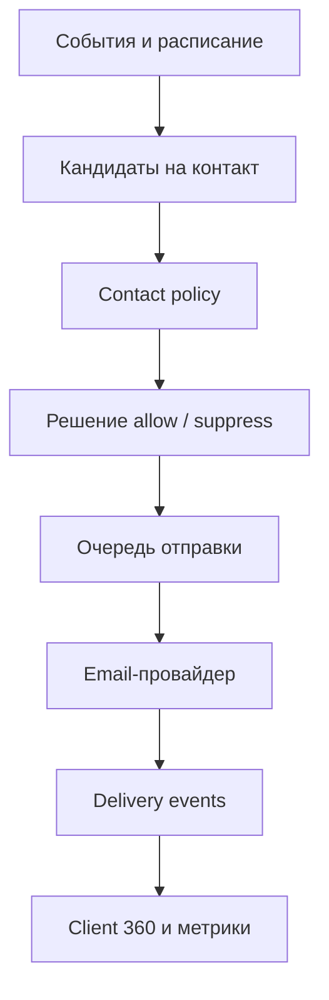

# 59. Полная операционная система email-маркетинга

## Цель

Email-система должна управлять отношениями, а не просто рассылать письма. Она обязана:

- отправлять полезное сообщение в правильный момент;
- различать сервис и маркетинг;
- останавливаться при покупке, ответе, жалобе, отписке или открытой проблеме;
- учитывать все остальные каналы;
- объяснять, почему конкретный человек получил конкретное письмо;
- измерять результат бизнеса и обучения, а не только открытия.

Документы [04-email-lifecycle.md](04-email-lifecycle.md), [18-campaign-governance.md](18-campaign-governance.md) и [41-email-deliverability.md](41-email-deliverability.md) задают общие принципы. Здесь описан исполняемый слой.

## 1. Архитектура



Компоненты:

1. Реестр программ.
2. Версионируемые шаблоны.
3. Сегментатор.
4. Оркестратор и правила приоритета.
5. Consent/suppression engine.
6. Очередь с idempotency.
7. Адаптер провайдера.
8. Приём webhook delivery events.
9. Аналитика и контрольная группа.
10. Ручной stop switch.

## 2. Обязательная классификация сообщения

Каждая отправка получает один `message_class`:

| Класс | Пример | Маркетинговое согласие |
|---|---|---:|
| `transactional_critical` | восстановление входа, результат платежа | не используется для рекламы |
| `service_requested` | ответ на заявку или вопрос | в пределах запроса |
| `service_contract` | срок доступа, изменение занятия | по договорному сценарию |
| `learning_report` | заказанный отчёт о прогрессе | отдельная настройка частоты |
| `marketing_lifecycle` | прогрев, возврат, новый курс | обязательно |
| `marketing_promo` | акция, скидка, промокод | обязательно |
| `relationship` | день рождения, годовщина | отдельное разрешение/настройка |

Добавление цены, скидки, продажи или нерелевантного оффера может превратить сервисное письмо в маркетинговое. Классификацию нельзя определять только по названию шаблона.

## 3. Каталог программ

### Лид и пробный доступ

| Program key | Старт | Основная цель | Стоп-события |
|---|---|---|---|
| `lead_ack` | заявка принята | подтвердить получение и следующий шаг | `lead_invalid`, `consent_withdrawn` |
| `lead_operator_pending` | нет ответа оператора в SLA | объяснить ожидание | `operator_contacted` |
| `trial_access` | пробник создан | доставить доступ | `first_login`, `access_revoked` |
| `trial_no_login` | нет входа 2/12/24 ч | убрать барьер входа | `first_login`, `support_case_opened` |
| `trial_first_value` | первый вход, нет полезного действия | довести до первого результата | `first_value`, `trial_expired` |
| `trial_repeat_use` | есть первый результат | вернуть на второй сеанс | `second_session_started`, `payment_succeeded` |
| `trial_value_summary` | результат пробника | показать родителю факт результата | `payment_succeeded`, `explicit_no` |
| `trial_checkout` | сформирован оффер | объяснить тариф и оплату | `payment_succeeded`, `checkout_expired` |
| `checkout_recovery` | checkout без оплаты | выяснить технический барьер | `payment_succeeded`, `payment_failed_support` |
| `trial_closed_feedback` | пробник закончился без покупки | узнать причину без давления | `feedback_received`, `opt_out` |

### Покупатель и обучение

| Program key | Старт | Цель | Стоп |
|---|---|---|---|
| `buyer_welcome` | подтверждённая оплата | объяснить доступ и первый шаг | `first_paid_session` |
| `week_one_habit` | начало доступа | сформировать 2–3 учебные сессии | `habit_milestone`, `paused` |
| `learning_nudge` | допустимый период без активности | мягко вернуть | `learning_resumed`, `paused` |
| `weekly_parent_report` | конец недели | показать действия и следующий шаг | preference off |
| `milestone_celebration` | достижение | закрепить ощущение прогресса | нет, но есть cap |
| `topic_recommendation` | школьная тема известна | предложить релевантный модуль | `module_started` |
| `stuck_support` | повторные ошибки/нет прогресса | предложить помощь | `support_case_opened`, `learning_resumed` |
| `course_complete` | курс завершён | подвести итог и дать маршрут | новый enrollment |

### Платёж и удержание

| Program key | Старт | Цель | Стоп |
|---|---|---|---|
| `payment_receipt_notice` | payment succeeded | подтвердить факт и период | — |
| `renewal_preview` | до окончания доступа | дать понятный выбор | renewal/cancel |
| `renewal_due` | дата продления | предотвратить случайный разрыв | renewal/cancel |
| `payment_failed_recovery` | безопасный failure code | восстановить оплату | success/manual resolution |
| `access_grace_period` | есть grace period | объяснить срок без угроз | success/end |
| `refund_status` | refund state changed | сообщить статус | refund completed |
| `pause_return` | срок паузы заканчивается | помочь вернуться | resumed/cancelled |
| `churn_save` | подтверждённый риск | человеческое решение проблемы | case opened/resolved |

### Отношения и рост

| Program key | Старт | Цель | Стоп |
|---|---|---|---|
| `birthday_guardian` | разрешённая дата взрослого | тёплое поздравление | birthday preference off |
| `birthday_student_to_guardian` | разрешённый сценарий | поздравить через взрослого | consent off |
| `learning_anniversary` | год с первого занятия | показать путь | opt-out |
| `review_request` | доказанный результат | попросить честный отзыв | review submitted/declined |
| `referral_invite` | высокий trust + разрешение | предложить рекомендацию | shared/declined |
| `seasonal_relevance` | новый учебный период | релевантная помощь | purchase/opt-out |
| `winback` | бывший клиент + согласие | вернуть по конкретной пользе | purchase/explicit no |
| `content_digest` | подписка на тему | регулярно помогать | preference off |

## 4. Карточка программы

Любая программа обязана иметь:

```yaml
program_key: trial_no_login
version: 1
owner: lifecycle_marketing
message_class: service_requested
entry_event: trial_created
eligibility_rule: no_first_login
required_purpose: requested_trial_followup
exclusions:
  - active_support_case
  - explicit_no
  - invalid_email
steps:
  - delay: PT2H
    template_role: access_help
  - delay: PT10H
    template_role: login_barrier
stop_events:
  - first_login
  - payment_succeeded
  - unsubscribe_requested
frequency_group: trial_support
success_event: first_login
attribution_window: P3D
```

YAML выше — иллюстрация. Канонический машинный вариант хранится в [email-programs.json](email-programs.json).

## 5. Решение об отправке

До постановки в очередь система проверяет в указанном порядке:

1. Существует ли человек и активна ли семья.
2. Есть ли подходящий verified контакт.
3. Каков класс сообщения.
4. Есть ли требуемое согласие или сервисное основание.
5. Нет ли глобальной, семейной, адресной или тематической блокировки.
6. Не было ли hard bounce или complaint.
7. Не выполнено ли stop-событие после расчёта кандидата.
8. Нет ли открытого критического обращения или возврата.
9. Не превышен ли cap семьи, канала, программы и темы.
10. Наступило ли разрешённое локальное время.
11. Не запланировано ли более важное сообщение.
12. Актуальны ли offer, цена, CTA и ссылка.
13. Одобрены ли template version и campaign version.
14. Не создавалась ли отправка с тем же idempotency key.

Результат сохраняется как `send_decision` с кодом причины. Нельзя просто молча исключить адресата.

## 6. Приоритеты

От наиболее важного к наименее важному:

1. безопасность и privacy;
2. восстановление доступа и критическая поддержка;
3. платёж/возврат по факту;
4. ответ на прямой вопрос;
5. обещанное сообщение;
6. действие по активному пробнику;
7. обучение и отчёты;
8. продление;
9. relationship;
10. контентный маркетинг;
11. промо.

Более низкий приоритет переносится или отменяется, если в том же окне есть более высокий.

## 7. Частотная политика по умолчанию

До появления статистики использовать консервативные ограничения:

- максимум 1 маркетинговое письмо за 24 часа;
- максимум 3 маркетинговых письма за 7 дней;
- максимум 5 автоматических контактов всеми маркетинговыми каналами за 7 дней;
- повтор одной темы не ранее 72 часов;
- после явного ответа — пауза автоматического дожима на 24 часа;
- после complaint/opt-out — немедленная постоянная блокировка соответствующего назначения;
- сервисные критические уведомления не расходуют marketing cap, но не содержат скрытой рекламы;
- лимиты считаются на семью и контакт, а не только на email.

Это стартовые guardrails, а не цель увеличить число касаний.

## 8. Время отправки

- Использовать IANA timezone семьи или взрослого.
- Не отправлять маркетинг ночью; стартовое окно: 09:00–20:00 локального времени.
- Если timezone неизвестен, применять безопасное окно для основного региона или ставить в ручную проверку.
- Deadline в письме и на лендинге должен иметь одну временную зону и один источник истины.
- Нельзя писать «сегодня» или «до полуночи», если срок может отличаться в разных зонах.

## 9. Персонализация

Разрешённые типы:

- предпочтительное имя взрослого;
- имя ребёнка только в закрытом письме законному представителю и при необходимости;
- класс, учебник, текущий модуль;
- фактический прогресс;
- период доступа и оплаченный продукт;
- последний подтверждённый барьер;
- выбранная тема подписки.

Запрещённые типы:

- догадки о доходе или семейной ситуации;
- медицинские и психологические выводы;
- манипуляция страхом отставания;
- раскрытие данных одного ребёнка другому взрослому без прав;
- выводы по одному открытию письма;
- скрытая вставка персональных данных в URL.

Каждая переменная имеет fallback. Если нет достоверного значения, предложение должно оставаться грамматически и фактически корректным.

## 10. Шаблон и контент

Поля шаблона:

- `template_id`, `version`, `status`;
- класс и программа;
- subject и preheader;
- plain text и HTML;
- обязательный footer;
- primary CTA и fallback URL;
- переменные и правила fallback;
- разрешённые offers;
- требуемый purpose;
- legal/brand review;
- дата последней проверки ссылок;
- тестовые сценарии;
- hash утверждённой версии.

Для маркетингового письма обязательны понятный отправитель, основание получения, рабочая отписка и preference center.

## 11. Event-модель доставки

Последовательность:

`candidate_created → send_allowed → queued → provider_accepted → delivered`

Возможные ветки:

- `suppressed`;
- `cancelled_by_stop_event`;
- `soft_bounced`;
- `hard_bounced`;
- `complaint_received`;
- `unsubscribe_requested`;
- `clicked`;
- `replied`;
- `converted`.

Open — диагностический сигнал. Из-за блокировки картинок, privacy proxy и автоматических сканеров он не является надёжным доказательством чтения.

## 12. Метрики

### Главные

- доля программы, достигшая business/learning outcome;
- incremental conversion против holdout;
- first login, first value, second session;
- payment success и retained access;
- reply with resolved question;
- возвраты и жалобы после кампании;
- revenue per eligible family, а не только per sent;
- unsubscribe/complaint rate;
- доля людей, которым не отправили из-за защитных правил.

### Диагностические

- delivery rate;
- hard/soft bounce;
- click-through;
- reply rate;
- time to outcome;
- template rendering failures;
- webhook lag;
- share of unknown consent;
- frequency-cap suppression.

Не оптимизировать программу только по open rate или кликам: это может увеличить давление без пользы.

## 13. Attribution

Письмо может получить:

- `direct`: целевое событие после verified click и в окне программы;
- `assisted`: контакт был одним из нескольких касаний;
- `operational`: письмо помогло решить проблему, но не считается продажей;
- `holdout_incremental`: разница с контрольной группой;
- `unattributed`: связи недостаточно.

Последний email-клик не должен стирать UGC, рекламный или органический источник привлечения. Хранить first touch, lead source, conversion assist и last eligible touch отдельно.

## 14. Эксперименты

Тестировать только одну главную гипотезу на эксперимент:

- время;
- тема;
- формат доказательства;
- CTA;
- длина;
- число шагов;
- обучение против скидки.

Единица рандомизации — `family_id`, чтобы разные взрослые одной семьи не получили разные условия. Guardrails: жалобы, отписки, возвраты, support load, скидочная зависимость.

На малой выборке показывать абсолютные числа и доверительный статус: `exploratory`, `directional`, `strong`, `insufficient`.

## 15. Deliverability

- отдельные потоки/поддомены для сервисных и маркетинговых отправок, если провайдер и объём это оправдывают;
- SPF, DKIM, DMARC и выровненный From;
- постепенный прогрев нового домена;
- suppression сразу после hard bounce/complaint;
- очистка неизвестных и неактивных адресов через re-permission, а не бесконечную отправку;
- seed/inbox tests перед крупным запуском;
- мониторинг репутации домена и provider errors;
- запрет купленных баз.

## 16. Ежедневная работа

### Утро

- сбои webhook и очереди;
- complaints, hard bounces, рост soft bounce;
- застрявшие сервисные письма;
- программы с аномальной конверсией;
- кандидаты, заблокированные из-за конфликтов данных;
- новые ответы, требующие человека.

### Перед массовой отправкой

- dry run;
- размер аудитории и 20 синтетических примеров;
- exclusions и cap;
- согласия;
- цена, срок и ссылки;
- mobile/dark mode/plain text;
- stop events;
- владелец rollback;
- письменное одобрение версии.

### После отправки

- первые delivery errors;
- complaints;
- неожиданные ответы;
- корректность stop events;
- оплата/возвраты/обращения;
- итог через полное окно атрибуции.

## 17. Аварийная остановка

Одна кнопка/feature flag должна уметь:

- остановить весь marketing;
- остановить программу;
- остановить template version;
- остановить конкретный домен/провайдер;
- отменить ещё не отправленные queued сообщения;
- сохранить причину, автора и время;
- не блокировать критический сервис без отдельного решения.

## 18. Критерии приёмки

- для любой отправки видны программа, шаблон, согласие, решение и причина;
- повтор webhook не создаёт второе письмо;
- покупка останавливает дожим до следующей отправки;
- ответ клиента ставит автоматический дожим на паузу;
- complaint блокирует маркетинг немедленно;
- hard bounce не получает повторные письма;
- два канала соблюдают единый семейный cap;
- изменение цены не меняет уже утверждённую кампанию незаметно;
- контрольная группа не получает шаги тестируемой программы;
- ни одно реальное письмо не отправляется из staging;
- база знаний не содержит реальных получателей или provider tokens.
