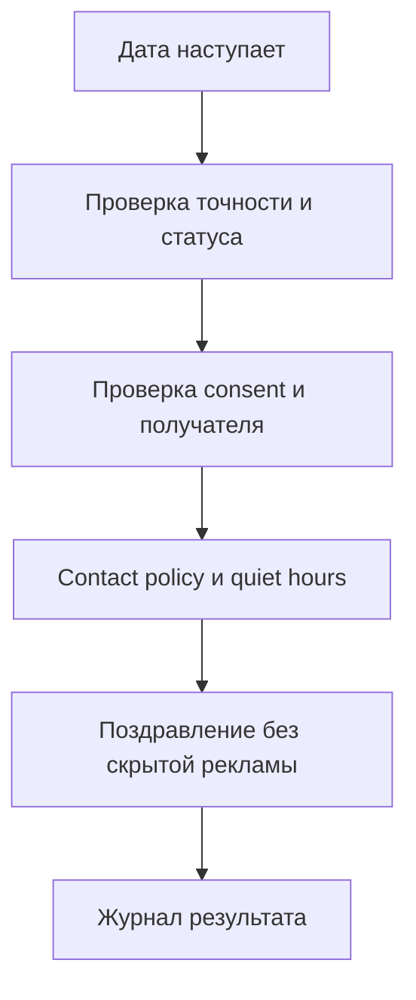

# 60. Даты, дни рождения и occasion engine

## Принцип

Дата — не повод автоматически писать. Она становится триггером только если известны:

- цель;
- источник и точность;
- подходящий получатель;
- согласие/настройка;
- срок хранения;
- безопасный сценарий;
- stop conditions.

Особенно осторожно обрабатываются даты детей. Для поздравления часто достаточно месяца и дня, для возрастной пригодности курса — года рождения или возрастной группы. Полная дата рождения не собирается «на всякий случай».

## 1. Виды дат

### Личные

| Тип | Владелец | Точность по умолчанию | Возможный сценарий |
|---|---|---:|---|
| день рождения взрослого | guardian | MM-DD | поздравление по настройке |
| день рождения ребёнка | student | MM-DD или year | сообщение законному представителю |
| предпочтительный день связи | guardian | weekday/window | планирование контакта |
| локальный часовой пояс | guardian/family | IANA | безопасное время отправки |

### Отношения

| Тип | Как получается | Сценарий |
|---|---|---|
| первая заявка | event | годовщина знакомства, аналитика |
| первый пробник | enrollment | cohort и повторный интерес |
| первый результат | learning event | milestone |
| первая оплата | payment | customer anniversary |
| первое занятие | learning event | learning anniversary |
| последний человеческий контакт | interaction | задача follow-up |
| последний ответ клиента | interaction | остановка дожима |
| обещанный ответ | promise | SLA и очередь сотрудника |

### Учебные

- начало и конец доступа;
- пробные дни;
- ожидаемый переход в следующий класс;
- выбранный школьный модуль;
- контрольная/четверть — только если родитель сам сообщил и это нужно для помощи;
- milestone;
- период неактивности;
- дата отчёта родителю;
- согласованный перерыв и дата возврата.

### Финансовые

- создание заказа;
- дедлайн оплаты;
- оплата и период услуги;
- продление;
- grace period;
- запрос и завершение возврата;
- дата чека;
- chargeback/dispute;
- дата сверки и выплаты партнёру.

### Операционные

- задача и SLA;
- review согласия;
- окончание разрешения на UGC;
- срок действия оффера;
- дата удаления/архивации;
- ротация ключа;
- проверка интеграции;
- отчётный период.

## 2. Универсальная модель даты

`customer_dates` должна поддерживать не только точный день.

| Поле | Назначение |
|---|---|
| `customer_date_id` | UUID |
| `family_id` | семья |
| `guardian_id`, `student_id` | необязательная принадлежность |
| `date_type` | справочник типов |
| `date_value` | дата, если точная |
| `month_day` | ежегодная дата без года |
| `year_value` | только год |
| `precision` | exact / month_day / month / year / estimated |
| `recurrence_rule` | annual / monthly / none / RRULE |
| `timezone` | зона исполнения |
| `source_system` | происхождение |
| `confidence` | verified / stated / inferred / imported |
| `purpose` | зачем хранится |
| `consent_purpose` | требуемое разрешение |
| `valid_from`, `valid_until` | срок действия |
| `last_confirmed_at` | свежесть |
| `status` | active / disputed / withdrawn / archived |

`estimated` дата не используется для поздравления и автоматического определения возраста.

## 3. Сбор дня рождения

Собирать дату только в контексте понятного выбора:

> Хотите получать спокойное поздравление без рекламных сообщений? Укажите день и месяц. Это необязательно, настройку можно отключить.

Для ребёнка:

- запрос адресован взрослому;
- объясняется назначение;
- не запрашивается больше точности, чем нужно;
- сообщение отправляется взрослому;
- данные не используются для публичного контента или UGC;
- возраст не выводится публично;
- отказ не влияет на доступ к курсу.

## 4. Birthday workflow

Проверки до отправки:

1. Запись активна и не оспаривается.
2. Точность достаточна.
3. Разрешён purpose `birthday`.
4. Для ребёнка получатель — уполномоченный взрослый.
5. Нет открытой жалобы, возврата, privacy request или тяжёлого support case.
6. Не было такого поздравления в текущем цикле.
7. Не превышены caps.
8. Шаблон не раскрывает возраст и другие данные.

## 5. Отделение поздравления от продажи

Стартовое правило:

- birthday-сообщение — relationship, без цены, дедлайна и давления;
- подарок может быть нематериальным: упражнение, открытка, игровой элемент;
- если нужен коммерческий оффер, это отдельная маркетинговая кампания с отдельным решением и интервалом;
- нельзя делать тему «С днём рождения», а внутри размещать обычную акцию.

## 6. Occasion engine

Движок ежедневно создаёт кандидатов на горизонтах:

- `T-30`: подготовка/проверка данных;
- `T-14`: операционная задача;
- `T-7`: допустимое предварительное напоминание;
- `T-3` и `T-1`: сервисные сценарии;
- `T0`: событие;
- `T+1`, `T+3`, `T+7`: follow-up, если уместно.

Кандидат не означает отправку. Он проходит общий contact policy.

## 7. Матрица сценариев

| Occasion | До | В день | После | Стоп |
|---|---|---|---|---|
| пробник | подготовить доступ | помощь со входом | итог/feedback | first value, payment, explicit no |
| конец доступа | объяснить варианты | сервисный статус | grace/recovery | renewal/cancel |
| день рождения | нет | поздравление | нет | preference off |
| learning anniversary | собрать факты | отчёт о пути | review request позже | open case |
| давно нет занятий | оценить причину | помощь вернуться | ручная задача | resumed/paused |
| возврат | SLA | статус | подтверждение завершения | refund completed |
| обещанный ответ | напомнить владельцу | эскалация | incident, если просрочено | promise done |
| учебный год | проверить класс | полезная навигация | релевантный курс | updated/opt-out |

## 8. Календарные коллизии

Если в один день совпали несколько событий:

1. privacy/support;
2. обещание;
3. доступ/платёж;
4. обучение;
5. relationship;
6. маркетинг.

Поздравление не отправляется поверх жалобы или возврата. Маркетинговое письмо переносится, если в ближайшие 24 часа есть сервисное.

## 9. Коррекция и отзыв

- Родитель может изменить или удалить дату в кабинете.
- Старая запись архивируется, не переписывается без следа.
- Отзыв birthday preference прекращает будущие задачи.
- При удалении цели сама дата удаляется или минимизируется по retention policy.
- Если дата оказалась ошибочной, система помечает все связанные отправки, но не пытается «компенсировать» новым автоматическим сообщением.

## 10. Метрики

- процент дат с понятной целью;
- процент точных дат без источника — должен быть 0;
- birthday opt-in rate;
- дубли поздравлений — 0;
- поздравления при открытой жалобе — 0;
- child birthday sent directly to child — 0;
- доля отключений после occasion-сообщений;
- доля исправленных/оспоренных дат;
- успешное выполнение обещаний в срок.

## 11. Критерии приёмки

- можно хранить только MM-DD без фиктивного года;
- можно хранить только год без фиктивного дня;
- неизвестная точность не превращается в exact;
- сценарий учитывает локальный часовой пояс;
- удаление birthday purpose прекращает отправки;
- детская дата не отображается создателю UGC или маркетинговому аналитику;
- одно событие создаёт не больше одного кандидата на шаг;
- открытая жалоба отменяет relationship/marketing контакт;
- все решения имеют объяснимый reason code.
