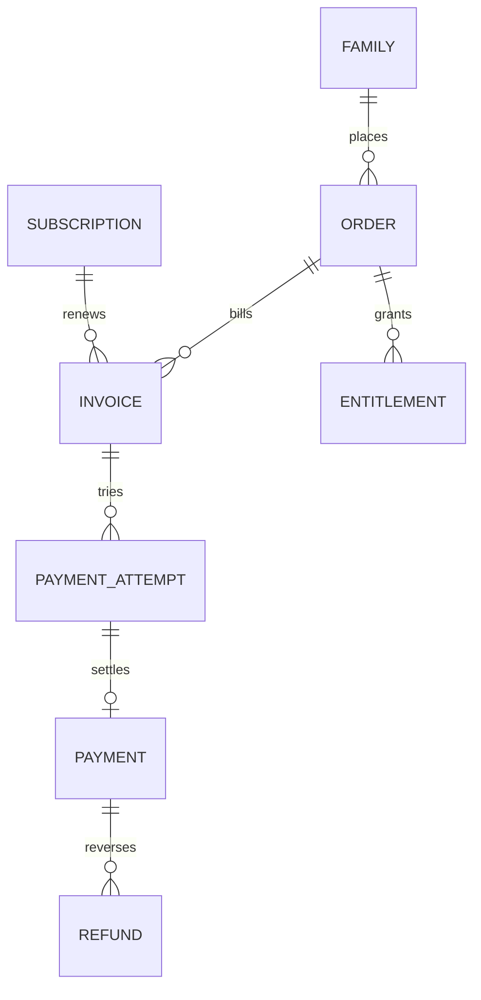

# 63. Финансовый ledger, доступ и сверка

## Цель

Система должна в любой момент отвечать:

- что семья заказала;
- сколько должна была заплатить;
- какие попытки оплаты были;
- сколько денег действительно получено;
- что возвращено или оспаривается;
- какой период обучения обеспечен;
- почему доступ активен, приостановлен или завершён;
- какой чек и уведомление сформированы;
- как платёж повлиял на комиссию креатора или партнёра.

Заметки, экран «успех» на сайте и Яндекс Метрика не являются источником финансовой истины.

## 1. Доменные сущности

### Order

Коммерческое намерение: продукт, тариф, версия цены, скидка, плательщик, получатель услуги.

### Invoice

Сумма к оплате и срок. Один order может иметь несколько invoices при рассрочке или изменении.

### Payment attempt

Попытка у провайдера. Неудачная попытка не создаёт выручку.

### Payment

Подтверждённое движение денег. Идемпотентно связывается с provider operation ID.

### Refund

Отдельная операция, полная или частичная. Исходный payment не переписывается.

### Chargeback/dispute

Отдельный статус спора с резервом и владельцем.

### Receipt/fiscal record

Ссылка на документ/статус. В Client 360 не хранить лишние фискальные или банковские реквизиты.

### Subscription

Правила периодического выставления/продления, но не данные карты.

### Entitlement

Право доступа к продукту на период. Оно связано с оплатой, пробником, бонусом или ручным решением.

## 2. Состояния

### Order

`draft → offered → confirmed → payment_pending → paid → fulfilled → completed`

Ветки: `expired`, `cancelled`, `refunded`, `disputed`.

### Invoice

`created → issued → pending → paid`

Ветки: `expired`, `cancelled`, `partially_paid`, `refunded`.

### Attempt

`created → redirected → provider_pending → succeeded | failed | cancelled | unknown`

`unknown` требует сверки, а не автоматического отказа.

### Refund

`requested → reviewed → submitted → processing → succeeded`

Ветки: `rejected`, `failed`, `cancelled`.

### Entitlement

`scheduled → active → grace → paused → expired`

Ветки: `cancelled`, `revoked`, `restored`.

## 3. Денежные суммы

Для order/invoice хранить:

- list price;
- discount amount;
- promo/offer ID и version;
- tax/fiscal category, если применимо;
- gross amount;
- currency;
- paid amount;
- refunded amount;
- chargeback amount;
- net cash received;
- partner/creator liability отдельно.

Формула:

`net_cash_received = succeeded_payments - succeeded_refunds - succeeded_chargebacks`

Не считать выручкой pending/failed attempts. Комиссии провайдера и налоги не вычитать из клиентского платежа молча: это отдельные expense/settlement факты.

## 4. Цена и оффер

Каждый order сохраняет snapshot:

- `offer_id`;
- `offer_version`;
- product/tariff;
- цена и валюта;
- срок действия;
- текст существенных условий;
- promo code;
- attribution campaign;
- creator campaign, если есть;
- согласованный период услуги.

Изменение текущего оффера не должно менять исторический order.

## 5. Платёжный webhook

Порядок обработки:

1. Проверить подпись по официальному алгоритму провайдера.
2. Проверить environment и merchant account.
3. Дедуплицировать по provider event/operation ID.
4. Найти invoice по внутреннему reference.
5. Сверить сумму и валюту.
6. Сохранить raw payload в защищённом краткоживущем хранилище, а hash — в ledger.
7. Создать immutable operation.
8. Пересчитать invoice/order.
9. Выдать или скорректировать entitlement.
10. Записать audit и event.
11. Поставить сервисное уведомление.
12. Обновить партнёрский commission ledger, если применимо.

Webhook отвечает быстро; тяжёлая обработка выполняется идемпотентной очередью.

## 6. Связь денег и доступа

Право доступа не должно вычисляться только из последнего статуса payment.

`entitlement` хранит:

- основание: trial/payment/manual_credit/scholarship/promo;
- продукт и ребёнка;
- начало/конец;
- grace period;
- источник операции;
- причину pause/revoke;
- кто утвердил ручное изменение;
- supersedes entitlement;
- audit trail.

Возврат не всегда означает мгновенное отключение: правило зависит от договора, периода услуги и решения поддержки. Это должно быть явной политикой, а не случайным side effect.

## 7. Повторные списания и продление

Для subscription:

- явное основание и версия условий;
- status;
- billing interval;
- next billing date;
- notice schedule;
- provider mandate/reference без данных карты;
- cancel requested/effective dates;
- retry policy;
- grace period;
- maximum retry count;
- stop on dispute/refund/privacy incident.

Нельзя считать сохранённую карту частью Client 360. Токен провайдера хранится только в защищённом payment contour.

## 8. Dunning

После неудачной оплаты:

1. Классифицировать безопасный failure code.
2. Не сообщать клиенту внутренние банковские детали.
3. Дать понятный следующий шаг.
4. Не повторять списание вне согласованной policy.
5. Учитывать cap и открытые обращения.
6. При повторном failure создать ручную задачу, если это полезно.
7. Остановить сообщения после success, cancel или explicit no.

## 9. Возвраты

Карточка возврата:

- инициатор;
- request time;
- payment/order;
- сумма;
- reason category;
- свободный комментарий ограниченно;
- policy version;
- reviewed by;
- решение;
- provider reference;
- expected and actual completion;
- notification history;
- access impact;
- creator commission impact;
- receipt/correction status.

Причина возврата используется для продукта только агрегированно. Она не должна автоматически присваивать клиенту негативный профиль.

## 10. Кредиты, бонусы и ручные корректировки

Любая корректировка — двойная запись в customer ledger:

- amount;
- direction;
- reason code;
- related order/payment;
- approved by;
- expiry;
- consumed by;
- immutable creation and reversal.

Нельзя менять сумму существующей операции. Ошибка исправляется reversing entry.

## 11. Ежедневная сверка

Сравниваются:

1. provider settlements/operations;
2. внутренние payment attempts/payments;
3. invoices/orders;
4. entitlements;
5. receipts;
6. refunds/chargebacks;
7. creator commission ledger;
8. accounting export, если подключён.

Статусы discrepancy:

- provider success, CRM missing;
- CRM success, provider missing;
- amount mismatch;
- currency mismatch;
- duplicate operation;
- payment without order;
- paid without access;
- access without active basis;
- refund without commission adjustment;
- receipt missing;
- stale pending.

Каждое расхождение имеет severity, владельца, SLA и resolution evidence.

## 12. Финансовые представления

### Семья

- total paid;
- total refunded;
- net cash;
- open balance;
- current entitlement;
- next billing/expiry;
- disputes;
- last payment/refund;
- manual credits.

### Продукт/когорта

- gross cash;
- refunds;
- net cash;
- trial-to-paid;
- renewal;
- average order value;
- revenue per eligible lead;
- refund rate;
- time to pay;
- failed payment recovery.

### Не смешивать

- cash received;
- бухгалтерскую выручку;
- profit;
- LTV estimate;
- creator payable;
- provider settlement.

Каждая метрика имеет собственную формулу.

## 13. Доступ и роли

- оператор видит статус, сумму, период и допустимое действие;
- finance видит операции и сверку;
- owner видит агрегаты и корректировки;
- creator видит только свой агрегированный commission ledger;
- аналитик получает псевдонимизированные факты;
- никто в Client 360 не видит CVV, полный номер карты или секрет провайдера.

## 14. Alerts

Критические:

- подпись webhook не прошла;
- сумма не совпала;
- success без order;
- массовый рост failed;
- refund просрочен;
- paid без access;
- duplicate success;
- chargeback;
- settlement mismatch;
- комиссия начислена по возвращённому платежу.

## 15. Критерии приёмки

- повтор одного webhook не удваивает платёж или доступ;
- client-side success не создаёт оплату;
- частичный возврат правильно меняет net cash и commission;
- историческая цена не меняется после обновления offer;
- оплаченный период объясним до дня;
- paid without access выявляется сверкой;
- refund содержит SLA и уведомления;
- reversing entry сохраняет исходную операцию;
- каждая ручная корректировка имеет approval и audit;
- реальные операции, чеки и provider payloads не попадают в публичный GitHub.
