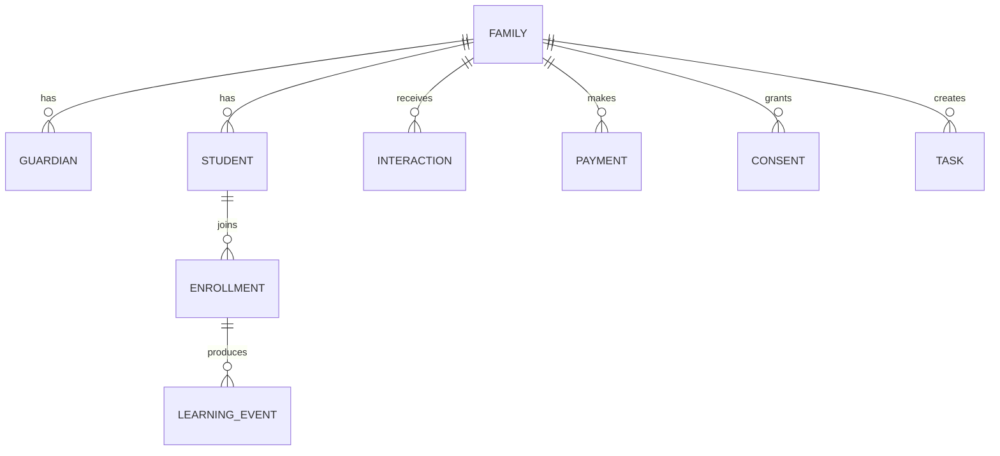

# LANGUST Client 360

Статус: проект системы, версия 1.0  
Владелец процесса: Татьяна Владимировна  
Назначение: единая память о семьях, детях, обучении, контактах, оплатах и поведении — без хранения реальных персональных данных в публичном GitHub.

## Критическое правило

`langustlingua/Base` — публичный репозиторий. Здесь хранятся только:

- структура системы;
- названия полей и событий;
- бизнес-правила;
- шаблоны сообщений;
- SQL-схема без данных;
- примеры только с вымышленными людьми;
- инструкции по внедрению.

Нельзя коммитить сюда реальные ФИО, email, телефоны, даты рождения, имена детей, платежи, переписку, IP-адреса, идентификаторы ProgressMe, Robokassa или Tilda, файлы `clients.json`, выгрузки и резервные копии.

## Что должна дать система

Вместо разрозненных писем и таблиц у каждой семьи появляется одна карточка:

1. Кто родитель и сколько у него детей.
2. Какой курс, учебник, класс и текущая школьная тема у каждого ребёнка.
3. Откуда пришла семья и на что дала согласие.
4. Какие письма, сообщения и звонки уже были.
5. Что ребёнок делал в пробнике и платном курсе.
6. Какие оплаты прошли, были возвращены или просрочены.
7. Когда семья заходила на сайт и в личный кабинет.
8. Какие вопросы, жалобы и обещания остались незакрытыми.
9. Когда нужно написать снова и почему.
10. Что именно системе разрешено отправлять этой семье.

## Состав базы знаний

| Документ | Что внутри |
|---|---|
| [01-system-map.md](01-system-map.md) | Источники, контуры и поток данных |
| [02-data-dictionary.md](02-data-dictionary.md) | Полный словарь сущностей и полей |
| [03-event-taxonomy.md](03-event-taxonomy.md) | События сайта, курса, писем и оплат |
| [04-email-lifecycle.md](04-email-lifecycle.md) | Email-маркетинг на всём жизненном цикле |
| [05-communications-journals.md](05-communications-journals.md) | Контакты, дневники, задачи, обещания и поддержка |
| [06-payments-visits-learning.md](06-payments-visits-learning.md) | Оплаты, визиты, время на сайте и обучение |
| [07-segmentation-scoring.md](07-segmentation-scoring.md) | Сегменты, health score, lead score и next best action |
| [08-dashboards-kpis.md](08-dashboards-kpis.md) | Дашборды и формулы показателей |
| [09-privacy-security.md](09-privacy-security.md) | Согласия, дети, хранение, роли и удаление |
| [10-implementation-roadmap.md](10-implementation-roadmap.md) | Порядок внедрения без попытки сделать всё сразу |
| [11-admin-console.md](11-admin-console.md) | Экраны и рабочая логика админ-консоли |
| [12-import-and-data-quality.md](12-import-and-data-quality.md) | Импорт `clients.json`, дубли и проверки качества |
| [13-automation-rules.md](13-automation-rules.md) | Каталог триггерных автоматизаций и приоритеты |
| [14-feedback-and-research.md](14-feedback-and-research.md) | Обратная связь, интервью, дневниковые исследования и кейсы |
| [schema.sql](schema.sql) | Базовая SQL-схема Client 360 |
| [event-schema.json](event-schema.json) | Машиночитаемый контракт событий |

## Основные сущности

## Главный рабочий экран

Карточка семьи должна показывать сверху вниз:

- имя родителя, город, часовой пояс, удобный канал;
- дети и активные курсы;
- статус жизненного цикла;
- согласия и запреты на коммуникации;
- следующий лучший шаг;
- ближайшая задача;
- последние три контакта;
- последнюю активность ребёнка;
- баланс и последнюю оплату;
- риск ухода;
- важные даты;
- предупреждения: недоставляемый email, ошибка входа, возврат, жалоба, обещанный ответ.

## Не «собирать всё», а знать зачем

Каждое поле должно отвечать хотя бы на один вопрос:

- улучшает ли оно обучение;
- помогает ли обслужить договор или платёж;
- позволяет ли выполнить просьбу клиента;
- нужно ли оно для законной коммуникации;
- помогает ли оно измерить продукт;
- обязаны ли мы хранить его по закону.

Если ни на один вопрос нет ответа, поле не собирается. Дата рождения ребёнка «на всякий случай» — плохое поле. Месяц рождения для разрешённого поздравления может быть достаточен; точная дата нужна только при ясной цели и основании.
