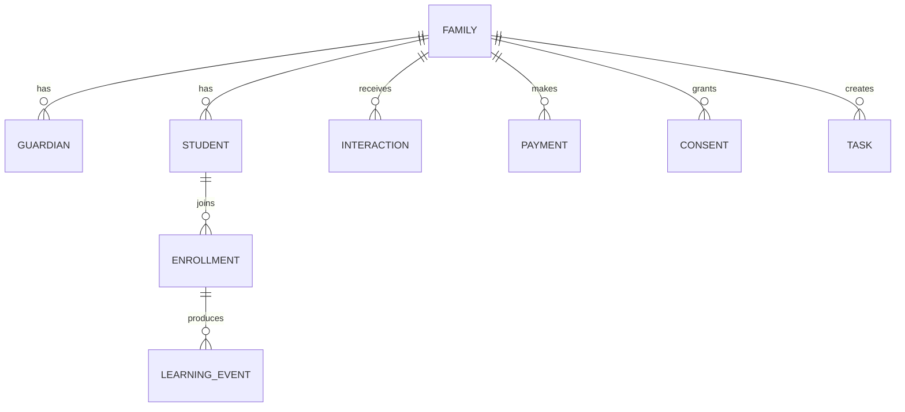

# LANGUST Client 360

Статус: проект системы, версия 1.0  
Владелец процесса: Татьяна Владимировна  
Назначение: единая память о семьях, детях, обучении, контактах, оплатах и поведении — без хранения реальных персональных данных в публичном GitHub.

## Критическое правило

`langustlingua/Base` — публичный репозиторий. Здесь хранятся только:

- структура системы;
- названия полей и событий;
- бизнес-правила;
- шаблоны сообщений;
- SQL-схема без данных;
- примеры только с вымышленными людьми;
- инструкции по внедрению.

Нельзя коммитить сюда реальные ФИО, email, телефоны, даты рождения, имена детей, платежи, переписку, IP-адреса, идентификаторы ProgressMe, Robokassa или Tilda, файлы `clients.json`, выгрузки и резервные копии.

## Что должна дать система

Вместо разрозненных писем и таблиц у каждой семьи появляется одна карточка:

1. Кто родитель и сколько у него детей.
2. Какой курс, учебник, класс и текущая школьная тема у каждого ребёнка.
3. Откуда пришла семья и на что дала согласие.
4. Какие письма, сообщения и звонки уже были.
5. Что ребёнок делал в пробнике и платном курсе.
6. Какие оплаты прошли, были возвращены или просрочены.
7. Когда семья заходила на сайт и в личный кабинет.
8. Какие вопросы, жалобы и обещания остались незакрытыми.
9. Когда нужно написать снова и почему.
10. Что именно системе разрешено отправлять этой семье.

## Состав базы знаний

| Документ | Что внутри |
|---|---|
| [01-system-map.md](01-system-map.md) | Источники, контуры и поток данных |
| [02-data-dictionary.md](02-data-dictionary.md) | Полный словарь сущностей и полей |
| [03-event-taxonomy.md](03-event-taxonomy.md) | События сайта, курса, писем и оплат |
| [04-email-lifecycle.md](04-email-lifecycle.md) | Email-маркетинг на всём жизненном цикле |
| [05-communications-journals.md](05-communications-journals.md) | Контакты, дневники, задачи, обещания и поддержка |
| [06-payments-visits-learning.md](06-payments-visits-learning.md) | Оплаты, визиты, время на сайте и обучение |
| [07-segmentation-scoring.md](07-segmentation-scoring.md) | Сегменты, health score, lead score и next best action |
| [08-dashboards-kpis.md](08-dashboards-kpis.md) | Дашборды и формулы показателей |
| [09-privacy-security.md](09-privacy-security.md) | Согласия, дети, хранение, роли и удаление |
| [10-implementation-roadmap.md](10-implementation-roadmap.md) | Порядок внедрения без попытки сделать всё сразу |
| [11-admin-console.md](11-admin-console.md) | Экраны и рабочая логика админ-консоли |
| [12-import-and-data-quality.md](12-import-and-data-quality.md) | Импорт `clients.json`, дубли и проверки качества |
| [13-automation-rules.md](13-automation-rules.md) | Каталог триггерных автоматизаций и приоритеты |
| [14-feedback-and-research.md](14-feedback-and-research.md) | Обратная связь, интервью, дневниковые исследования и кейсы |
| [15-progressive-profiling.md](15-progressive-profiling.md) | Какие сведения и в какой момент собирать |
| [16-retention-calendar.md](16-retention-calendar.md) | Календарь отношений на месяц и учебный год |
| [17-operating-rhythm.md](17-operating-rhythm.md) | Ежедневные, недельные, месячные и квартальные процессы |
| [18-campaign-governance.md](18-campaign-governance.md) | Dry run, одобрение владельца и безопасный запуск кампаний |
| [19-attribution-and-utm.md](19-attribution-and-utm.md) | Источники, UTM, QR и модели атрибуции |
| [20-web-analytics-implementation.md](20-web-analytics-implementation.md) | Реализация web-событий и engaged time |
| [21-consent-and-preference-center.md](21-consent-and-preference-center.md) | Центр согласий, отписка, email verification и OAuth |
| [22-parent-reports.md](22-parent-reports.md) | Недельные и месячные отчёты родителям |
| [23-churn-and-winback.md](23-churn-and-winback.md) | Риск ухода, причины и корректный возврат |
| [24-referrals-reviews-and-ugc.md](24-referrals-reviews-and-ugc.md) | Рекомендации, отзывы, кейсы и права UGC |
| [25-financial-operations.md](25-financial-operations.md) | Доходы, расходы, прибыль, подписки и сверка |
| [26-support-sla-and-self-service.md](26-support-sla-and-self-service.md) | SLA поддержки, макросы и самообслуживание |
| [27-retention-matrix.md](27-retention-matrix.md) | Категории сроков хранения и удаление семьи |
| [28-security-operations.md](28-security-operations.md) | 2FA, OAuth, API keys, backups и security review |
| [29-integration-contracts.md](29-integration-contracts.md) | Webhook-контракты Tilda, ProgressMe, Robokassa и каналов |
| [30-qa-and-release-checklists.md](30-qa-and-release-checklists.md) | QA импорта, автоматизаций, кабинета и релизов |
| [31-customer-dates-and-occasions.md](31-customer-dates-and-occasions.md) | Дни рождения, годовщины, учебные и операционные даты |
| [32-offer-and-template-registry.md](32-offer-and-template-registry.md) | Единый источник цен, офферов и шаблонов |
| [33-experiment-registry.md](33-experiment-registry.md) | Реестр гипотез, guardrails и правила тестов |
| [34-data-warehouse.md](34-data-warehouse.md) | Аналитический слой, факты, измерения и snapshots |
| [35-contact-outcome-codes.md](35-contact-outcome-codes.md) | Единые исходы звонков, писем, сообщений и встреч |
| [36-attendance-and-absence.md](36-attendance-and-absence.md) | Посещаемость, пропуски, переносы и реактивация |
| [37-daily-digest-spec.md](37-daily-digest-spec.md) | Утренний и вечерний дайджест для команды |
| [38-permissions-matrix.md](38-permissions-matrix.md) | Роли, доступ к данным и опасные операции |
| [39-risk-register.md](39-risk-register.md) | Реестр продуктовых, операционных и security-рисков |
| [40-implementation-backlog.md](40-implementation-backlog.md) | Приоритизированный бэклог внедрения с критериями готовности |
| [41-email-deliverability.md](41-email-deliverability.md) | Репутация домена, bounce, complaints и остановка кампаний |
| [42-metric-dictionary.md](42-metric-dictionary.md) | Канонические формулы продуктовых, финансовых и email-метрик |
| [43-incident-response.md](43-incident-response.md) | Уровни инцидентов, containment, восстановление и разбор |
| [44-data-subject-requests.md](44-data-subject-requests.md) | Доступ, исправление, удаление и ограничение обработки |
| [45-family-journey-state-machine.md](45-family-journey-state-machine.md) | Состояния семьи, переходы и правила коммуникаций |
| [schema.sql](schema.sql) | Базовая SQL-схема Client 360 |
| [views.sql](views.sql) | Представления семьи 360, воронки и очереди «Сегодня» |
| [event-schema.json](event-schema.json) | Машиночитаемый контракт событий |
| [campaign-schema.json](campaign-schema.json) | Машиночитаемый контракт кампании |
| [message-template-schema.json](message-template-schema.json) | Машиночитаемый контракт шаблона сообщения |

## Основные сущности

## Главный рабочий экран

Карточка семьи должна показывать сверху вниз:

- имя родителя, город, часовой пояс, удобный канал;
- дети и активные курсы;
- статус жизненного цикла;
- согласия и запреты на коммуникации;
- следующий лучший шаг;
- ближайшая задача;
- последние три контакта;
- последнюю активность ребёнка;
- баланс и последнюю оплату;
- риск ухода;
- важные даты;
- предупреждения: недоставляемый email, ошибка входа, возврат, жалоба, обещанный ответ.

## Не «собирать всё», а знать зачем

Каждое поле должно отвечать хотя бы на один вопрос:

- улучшает ли оно обучение;
- помогает ли обслужить договор или платёж;
- позволяет ли выполнить просьбу клиента;
- нужно ли оно для законной коммуникации;
- помогает ли оно измерить продукт;
- обязаны ли мы хранить его по закону.

Если ни на один вопрос нет ответа, поле не собирается. Дата рождения ребёнка «на всякий случай» — плохое поле. Месяц рождения для разрешённого поздравления может быть достаточен; точная дата нужна только при ясной цели и основании.
